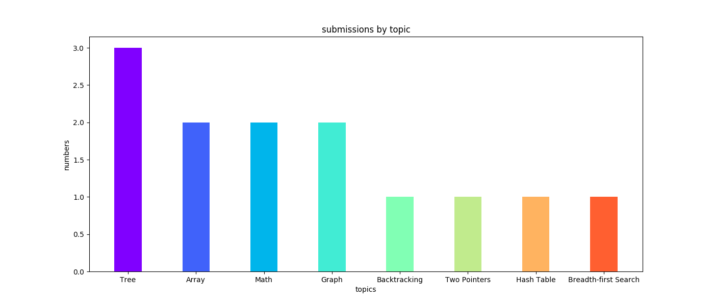
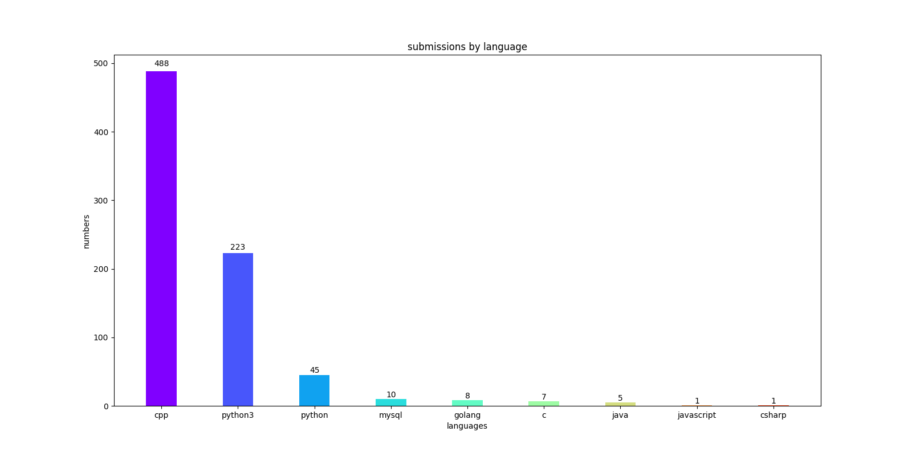
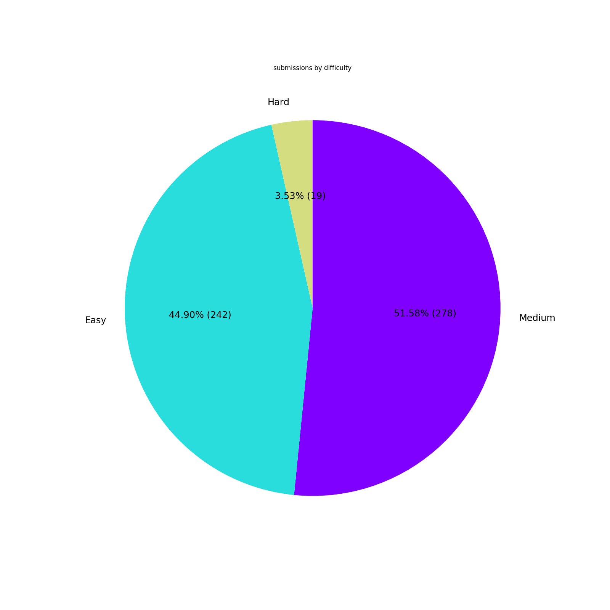

# LeetCode Archiver

[](https://travis-ci.com/ZintrulCre/LeetCode_Archiver)

Download personal submissions on LeetCode, generate summary figures and a markdown file.

## Use

- clone the project and enter the project root path

- create a file config.json where you config the username and password
```
{
  "username": "xxxx",
  "password": "xxxx"
}
```
- `python3 main.py`

## Note

### Programming languages currently supported

- C++, C, C#, Rust, Golang
- Java, Kotlin, Scala
- Python3, Python, Ruby, JavaScript, PHP
- Swift
- MySQL

### Feature

- download personal submissions on LeetCode
- generate summary figures and a markdown file

### Implementation

- Python3
- Scrapy
- requests
- numpy
- matplotlib

## Thanks to

- <a href="https://github.com/Excited-ccccly">Lingyun Chen</a>
- <a href="https://github.com/Ma63d">Chuck Liu</a>
- <a href="https://github.com/nusr">nusr</a>
- <a href="https://gist.github.com/fyears/487fc702ba814f0da367a17a2379e8ba">fyears/leetcode_stat.py</a>

## Demo

<p align="center"></p><h3 align='center'><strong>LeetCode Solutions</strong></center></h3><p align="center">Last Updated: 2019-5-5 17:54:12</p><p align="center">Downloaded by <a href = "https://github.com/ZintrulCre/LeetCode_Archiver">ZintrulCre/LeetCode_Archiver</a></p>

<p align="center"></p>

<p align="center"></p>

<p align="center"></p>

| # | title | submissions | topics | difficulty | accepted rate | likes | dislikes |
| :------: | :------: | :------: | :------: | :------: | :------: | :------: | :------: |
| 1038 | [Binary Search Tree to Greater Sum Tree](https://leetcode.com/problems/binary-search-tree-to-greater-sum-tree/) | [Python3](LeetCode/python3/1038.py), [C++](LeetCode/cpp/1038.cpp) | Binary Search Tree | Medium | 83.0% | 16 | 4
| 1037 | [Valid Boomerang](https://leetcode.com/problems/valid-boomerang/) | [C++](LeetCode/cpp/1037.cpp) | Math | Easy | 34.4% | 3 | 15
| 1035 | [Uncrossed Lines](https://leetcode.com/problems/uncrossed-lines/) | [C++](LeetCode/cpp/1035.cpp) | Array | Medium | 48.9% | 106 | 5
| 1034 | [Coloring A Border](https://leetcode.com/problems/coloring-a-border/) | [C++](LeetCode/cpp/1034.cpp) | Depth-first Search | Medium | 42.4% | 33 | 82
| 1033 | [Moving Stones Until Consecutive](https://leetcode.com/problems/moving-stones-until-consecutive/) | [Python3](LeetCode/python3/1033.py), [C++](LeetCode/cpp/1033.cpp) | Brainteaser | Easy | 31.8% | 15 | 170
| 1032 | [Stream of Characters](https://leetcode.com/problems/stream-of-characters/) | [C++](LeetCode/cpp/1032.cpp) | Trie | Hard | 39.6% | 66 | 18
| 1031 | [Maximum Sum of Two Non-Overlapping Subarrays](https://leetcode.com/problems/maximum-sum-of-two-non-overlapping-subarrays/) | [Python3](LeetCode/python3/1031.py), [C++](LeetCode/cpp/1031.cpp) | Array | Medium | 55.5% | 113 | 7
| 1030 | [Matrix Cells in Distance Order](https://leetcode.com/problems/matrix-cells-in-distance-order/) | [Python3](LeetCode/python3/1030.py), [C++](LeetCode/cpp/1030.cpp) | Sort | Easy | 67.2% | 49 | 22
| 1029 | [Two City Scheduling](https://leetcode.com/problems/two-city-scheduling/) | [Python3](LeetCode/python3/1029.py), [C++](LeetCode/cpp/1029.cpp) | Greedy | Easy | 53.2% | 147 | 12
| 1028 | [Recover a Tree From Preorder Traversal](https://leetcode.com/problems/recover-a-tree-from-preorder-traversal/) | [C++](LeetCode/cpp/1028.cpp) | Tree, Depth-first Search | Hard | 72.7% | 111 | 2
| 1027 | [Longest Arithmetic Sequence](https://leetcode.com/problems/longest-arithmetic-sequence/) | [C++](LeetCode/cpp/1027.cpp) | Dynamic Programming | Medium | 45.2% | 120 | 8
| 1026 | [Maximum Difference Between Node and Ancestor](https://leetcode.com/problems/maximum-difference-between-node-and-ancestor/) | [C++](LeetCode/cpp/1026.cpp), [Python3](LeetCode/python3/1026.py) | Tree, Depth-first Search | Medium | 58.2% | 93 | 7
| 1025 | [Divisor Game](https://leetcode.com/problems/divisor-game/) | [Python3](LeetCode/python3/1025.py), [Python](LeetCode/python/1025.py), [Golang](LeetCode/golang/1025.go), [JavaScript](LeetCode/javascript/1025.js), [C#](LeetCode/csharp/1025.cs), [Java](LeetCode/java/1025.java), [C](LeetCode/c/1025.c), [C++](LeetCode/cpp/1025.cpp) | Math, Dynamic Programming | Easy | 61.7% | 56 | 142
| 1024 | [Video Stitching](https://leetcode.com/problems/video-stitching/) | [C++](LeetCode/cpp/1024.cpp), [Python3](LeetCode/python3/1024.py) | Dynamic Programming | Medium | 47.4% | 120 | 15
| 1023 | [Camelcase Matching](https://leetcode.com/problems/camelcase-matching/) | [Python3](LeetCode/python3/1023.py), [C++](LeetCode/cpp/1023.cpp) | String, Trie | Medium | 57.2% | 44 | 43
| 1022 | [Sum of Root To Leaf Binary Numbers](https://leetcode.com/problems/sum-of-root-to-leaf-binary-numbers/) | [Python3](LeetCode/python3/1022.py), [C++](LeetCode/cpp/1022.cpp) | Tree | Easy | 50.3% | 62 | 47
| 1021 | [Remove Outermost Parentheses](https://leetcode.com/problems/remove-outermost-parentheses/) | [Python3](LeetCode/python3/1021.py), [C++](LeetCode/cpp/1021.cpp) | Stack | Easy | 77.4% | 81 | 102
| 1020 | [Number of Enclaves](https://leetcode.com/problems/number-of-enclaves/) | [Python3](LeetCode/python3/1020.py), [C++](LeetCode/cpp/1020.cpp) | Depth-first Search | Medium | 54.7% | 74 | 10
| 1019 | [Next Greater Node In Linked List](https://leetcode.com/problems/next-greater-node-in-linked-list/) | [Python3](LeetCode/python3/1019.py), [C++](LeetCode/cpp/1019.cpp) | Linked List, Stack | Medium | 56.2% | 140 | 13
| 1018 | [Binary Prefix Divisible By 5](https://leetcode.com/problems/binary-prefix-divisible-by-5/) | [Python3](LeetCode/python3/1018.py), [C++](LeetCode/cpp/1018.cpp) | Array | Easy | 46.0% | 44 | 38
| 1017 | [Convert to Base -2](https://leetcode.com/problems/convert-to-base-2/) | [Python3](LeetCode/python3/1017.py), [C++](LeetCode/cpp/1017.cpp) | Math | Medium | 55.5% | 54 | 81
| 1015 | [Smallest Integer Divisible by K](https://leetcode.com/problems/smallest-integer-divisible-by-k/) | [C++](LeetCode/cpp/1015.cpp), [Python](LeetCode/python/1015.py), [Python3](LeetCode/python3/1015.py) | Math | Medium | 27.5% | 46 | 138
| 1014 | [Best Sightseeing Pair](https://leetcode.com/problems/best-sightseeing-pair/) | [C++](LeetCode/cpp/1014.cpp), [Python](LeetCode/python/1014.py), [Python3](LeetCode/python3/1014.py) | Array | Medium | 48.0% | 158 | 11
| 1013 | [Partition Array Into Three Parts With Equal Sum](https://leetcode.com/problems/partition-array-into-three-parts-with-equal-sum/) | [C++](LeetCode/cpp/1013.cpp), [Python3](LeetCode/python3/1013.py), [Python](LeetCode/python/1013.py) | Array | Easy | 54.8% | 91 | 16
| 1011 | [Capacity To Ship Packages Within D Days](https://leetcode.com/problems/capacity-to-ship-packages-within-d-days/) | [C++](LeetCode/cpp/1011.cpp), [Python3](LeetCode/python3/1011.py) | Array, Binary Search | Medium | 52.0% | 203 | 9
| 1010 | [Pairs of Songs With Total Durations Divisible by 60](https://leetcode.com/problems/pairs-of-songs-with-total-durations-divisible-by-60/) | [Python3](LeetCode/python3/1010.py), [C++](LeetCode/cpp/1010.cpp) | Array | Easy | 45.0% | 107 | 8
| 1009 | [Complement of Base 10 Integer](https://leetcode.com/problems/complement-of-base-10-integer/) | [Python3](LeetCode/python3/1009.py), [C++](LeetCode/cpp/1009.cpp) | Math | Easy | 58.9% | 43 | 12
| 1008 | [Construct Binary Search Tree from Preorder Traversal](https://leetcode.com/problems/construct-binary-search-tree-from-preorder-traversal/) | [C++](LeetCode/cpp/1008.cpp) | Tree | Medium | 72.5% | 168 | 8
| 1007 | [Minimum Domino Rotations For Equal Row](https://leetcode.com/problems/minimum-domino-rotations-for-equal-row/) | [C++](LeetCode/cpp/1007.cpp) | Array, Greedy | Medium | 46.9% | 45 | 52
| 1006 | [Clumsy Factorial](https://leetcode.com/problems/clumsy-factorial/) | [Python3](LeetCode/python3/1006.py), [C++](LeetCode/cpp/1006.cpp) | Math | Medium | 54.0% | 33 | 73
| 1005 | [Maximize Sum Of Array After K Negations](https://leetcode.com/problems/maximize-sum-of-array-after-k-negations/) | [C++](LeetCode/cpp/1005.cpp) | Greedy | Easy | 49.5% | 85 | 14
| 1003 | [Check If Word Is Valid After Substitutions](https://leetcode.com/problems/check-if-word-is-valid-after-substitutions/) | [C++](LeetCode/cpp/1003.cpp), [Python3](LeetCode/python3/1003.py) | String, Stack | Medium | 51.9% | 62 | 112
| 1002 | [Find Common Characters](https://leetcode.com/problems/find-common-characters/) | [C++](LeetCode/cpp/1002.cpp), [Python3](LeetCode/python3/1002.py) | Array, Hash Table | Easy | 66.0% | 199 | 29
| 1001 | [Grid Illumination](https://leetcode.com/problems/grid-illumination/) | [C++](LeetCode/cpp/1001.cpp) | Hash Table | Hard | 34.2% | 86 | 34
| 999 | [Available Captures for Rook](https://leetcode.com/problems/available-captures-for-rook/) | [C++](LeetCode/cpp/999.cpp) | Array | Easy | 66.7% | 67 | 147
| 998 | [Maximum Binary Tree II](https://leetcode.com/problems/maximum-binary-tree-ii/) | [C++](LeetCode/cpp/998.cpp) | Tree | Medium | 62.2% | 61 | 133
| 997 | [Find the Town Judge](https://leetcode.com/problems/find-the-town-judge/) | [C++](LeetCode/cpp/997.cpp) | Graph | Easy | 48.7% | 112 | 19
| 995 | [Minimum Number of K Consecutive Bit Flips](https://leetcode.com/problems/minimum-number-of-k-consecutive-bit-flips/) | [C++](LeetCode/cpp/995.cpp) | Greedy, Sliding Window | Hard | 49.4% | 111 | 20
| 994 | [Rotting Oranges](https://leetcode.com/problems/rotting-oranges/) | [C++](LeetCode/cpp/994.cpp) | Breadth-first Search | Easy | 46.4% | 189 | 9
| 993 | [Cousins in Binary Tree](https://leetcode.com/problems/cousins-in-binary-tree/) | [C++](LeetCode/cpp/993.cpp) | Tree, Breadth-first Search | Easy | 52.5% | 138 | 8
| 991 | [Broken Calculator](https://leetcode.com/problems/broken-calculator/) | [Python3](LeetCode/python3/991.py), [C++](LeetCode/cpp/991.cpp), [Python](LeetCode/python/991.py), [Java](LeetCode/java/991.java), [C](LeetCode/c/991.c), [Golang](LeetCode/golang/991.go) | Math, Greedy | Medium | 39.7% | 115 | 49
| 990 | [Satisfiability of Equality Equations](https://leetcode.com/problems/satisfiability-of-equality-equations/) | [C++](LeetCode/cpp/990.cpp), [Python3](LeetCode/python3/990.py) | Union Find, Graph | Medium | 39.4% | 169 | 3
| 989 | [Add to Array-Form of Integer](https://leetcode.com/problems/add-to-array-form-of-integer/) | [Python3](LeetCode/python3/989.py), [C++](LeetCode/cpp/989.cpp) | Array | Easy | 44.6% | 97 | 17
| 988 | [Smallest String Starting From Leaf](https://leetcode.com/problems/smallest-string-starting-from-leaf/) | [Python3](LeetCode/python3/988.py), [C++](LeetCode/cpp/988.cpp) | Tree, Depth-first Search | Medium | 47.5% | 118 | 17
| 987 | [Vertical Order Traversal of a Binary Tree](https://leetcode.com/problems/vertical-order-traversal-of-a-binary-tree/) | [C++](LeetCode/cpp/987.cpp) | Hash Table, Tree | Medium | 32.5% | 91 | 201
| 986 | [Interval List Intersections](https://leetcode.com/problems/interval-list-intersections/) | [Python3](LeetCode/python3/986.py), [C++](LeetCode/cpp/986.cpp) | Two Pointers | Medium | 62.4% | 179 | 10
| 985 | [Sum of Even Numbers After Queries](https://leetcode.com/problems/sum-of-even-numbers-after-queries/) | [Golang](LeetCode/golang/985.go), [Python3](LeetCode/python3/985.py), [C++](LeetCode/cpp/985.cpp) | Array | Easy | 64.7% | 124 | 51
| 984 | [String Without AAA or BBB](https://leetcode.com/problems/string-without-aaa-or-bbb/) | [C++](LeetCode/cpp/984.cpp) | Greedy | Medium | 33.1% | 83 | 159
| 983 | [Minimum Cost For Tickets](https://leetcode.com/problems/minimum-cost-for-tickets/) | [C++](LeetCode/cpp/983.cpp) | Dynamic Programming | Medium | 57.2% | 377 | 8
| 982 | [Triples with Bitwise AND Equal To Zero](https://leetcode.com/problems/triples-with-bitwise-and-equal-to-zero/) | [C++](LeetCode/cpp/982.cpp) | Dynamic Programming | Hard | 53.6% | 48 | 69
| 981 | [Time Based Key-Value Store](https://leetcode.com/problems/time-based-key-value-store/) | [C++](LeetCode/cpp/981.cpp) | Hash Table, Binary Search | Medium | 50.6% | 143 | 29
| 979 | [Distribute Coins in Binary Tree](https://leetcode.com/problems/distribute-coins-in-binary-tree/) | [C++](LeetCode/cpp/979.cpp), [Python3](LeetCode/python3/979.py) | Tree, Depth-first Search | Medium | 66.6% | 422 | 10
| 978 | [Longest Turbulent Subarray](https://leetcode.com/problems/longest-turbulent-subarray/) | [Python3](LeetCode/python3/978.py), [C++](LeetCode/cpp/978.cpp) | Array, Dynamic Programming, Sliding Window | Medium | 45.5% | 77 | 37
| 977 | [Squares of a Sorted Array](https://leetcode.com/problems/squares-of-a-sorted-array/) | [C++](LeetCode/cpp/977.cpp), [Python3](LeetCode/python3/977.py) | Array, Two Pointers | Easy | 72.3% | 235 | 34
| 976 | [Largest Perimeter Triangle](https://leetcode.com/problems/largest-perimeter-triangle/) | [Python3](LeetCode/python3/976.py), [C++](LeetCode/cpp/976.cpp) | Math, Sort | Easy | 57.0% | 138 | 21
| 974 | [Subarray Sums Divisible by K](https://leetcode.com/problems/subarray-sums-divisible-by-k/) | [C++](LeetCode/cpp/974.cpp), [Python3](LeetCode/python3/974.py) | Array, Hash Table | Medium | 43.9% | 226 | 18
| 973 | [K Closest Points to Origin](https://leetcode.com/problems/k-closest-points-to-origin/) | [Python3](LeetCode/python3/973.py), [C++](LeetCode/cpp/973.cpp) | Divide and Conquer, Heap, Sort | Medium | 63.0% | 338 | 39
| 971 | [Flip Binary Tree To Match Preorder Traversal](https://leetcode.com/problems/flip-binary-tree-to-match-preorder-traversal/) | [C++](LeetCode/cpp/971.cpp) | Tree, Depth-first Search | Medium | 42.4% | 107 | 50
| 970 | [Powerful Integers](https://leetcode.com/problems/powerful-integers/) | [Python3](LeetCode/python3/970.py), [C++](LeetCode/cpp/970.cpp) | Hash Table, Math | Easy | 39.5% | 56 | 120
| 969 | [Pancake Sorting](https://leetcode.com/problems/pancake-sorting/) | [Python3](LeetCode/python3/969.py), [C++](LeetCode/cpp/969.cpp) | Array, Sort | Medium | 62.1% | 116 | 131
| 967 | [Numbers With Same Consecutive Differences](https://leetcode.com/problems/numbers-with-same-consecutive-differences/) | [Python3](LeetCode/python3/967.py), [C++](LeetCode/cpp/967.cpp) | Dynamic Programming | Medium | 36.8% | 76 | 25
| 966 | [Vowel Spellchecker](https://leetcode.com/problems/vowel-spellchecker/) | [Python3](LeetCode/python3/966.py), [C++](LeetCode/cpp/966.cpp) | Hash Table, String | Medium | 41.1% | 56 | 112
| 965 | [Univalued Binary Tree](https://leetcode.com/problems/univalued-binary-tree/) | [C++](LeetCode/cpp/965.cpp), [Python3](LeetCode/python3/965.py) | Tree | Easy | 67.0% | 154 | 28
| 962 | [Maximum Width Ramp](https://leetcode.com/problems/maximum-width-ramp/) | [C++](LeetCode/cpp/962.cpp) | Array | Medium | 41.1% | 228 | 9
| 961 | [N-Repeated Element in Size 2N Array](https://leetcode.com/problems/n-repeated-element-in-size-2n-array/) | [C++](LeetCode/cpp/961.cpp) | Hash Table | Easy | 72.6% | 172 | 120
| 958 | [Check Completeness of a Binary Tree](https://leetcode.com/problems/check-completeness-of-a-binary-tree/) | [C++](LeetCode/cpp/958.cpp) | Tree | Medium | 46.6% | 185 | 5
| 957 | [Prison Cells After N Days](https://leetcode.com/problems/prison-cells-after-n-days/) | [C++](LeetCode/cpp/957.cpp) | Hash Table | Medium | 38.0% | 87 | 172
| 954 | [Array of Doubled Pairs](https://leetcode.com/problems/array-of-doubled-pairs/) | [C++](LeetCode/cpp/954.cpp) | Array, Hash Table | Medium | 34.2% | 102 | 20
| 953 | [Verifying an Alien Dictionary](https://leetcode.com/problems/verifying-an-alien-dictionary/) | [C++](LeetCode/cpp/953.cpp) | Hash Table | Easy | 55.7% | 147 | 57
| 951 | [Flip Equivalent Binary Trees](https://leetcode.com/problems/flip-equivalent-binary-trees/) | [C++](LeetCode/cpp/951.cpp) | Tree | Medium | 65.2% | 202 | 7
| 949 | [Largest Time for Given Digits](https://leetcode.com/problems/largest-time-for-given-digits/) | [C++](LeetCode/cpp/949.cpp) | Math | Easy | 33.8% | 61 | 174
| 947 | [Most Stones Removed with Same Row or Column](https://leetcode.com/problems/most-stones-removed-with-same-row-or-column/) | [C++](LeetCode/cpp/947.cpp) | Depth-first Search, Union Find | Medium | 54.2% | 367 | 100
| 944 | [Delete Columns to Make Sorted](https://leetcode.com/problems/delete-columns-to-make-sorted/) | [C++](LeetCode/cpp/944.cpp) | Greedy | Easy | 69.3% | 39 | 783
| 942 | [DI String Match](https://leetcode.com/problems/di-string-match/) | [Python3](LeetCode/python3/942.py), [C++](LeetCode/cpp/942.cpp) | Math | Easy | 70.0% | 370 | 130
| 941 | [Valid Mountain Array](https://leetcode.com/problems/valid-mountain-array/) | [Python3](LeetCode/python3/941.py), [C++](LeetCode/cpp/941.cpp) | Array | Easy | 35.1% | 125 | 35
| 938 | [Range Sum of BST](https://leetcode.com/problems/range-sum-of-bst/) | [Python](LeetCode/python/938.py), [Python3](LeetCode/python3/938.py), [C++](LeetCode/cpp/938.cpp) | Tree, Recursion | Easy | 80.3% | 273 | 36
| 933 | [Number of Recent Calls](https://leetcode.com/problems/number-of-recent-calls/) | [C++](LeetCode/cpp/933.cpp), [Python3](LeetCode/python3/933.py) | Queue | Easy | 69.4% | 117 | 524
| 931 | [Minimum Falling Path Sum](https://leetcode.com/problems/minimum-falling-path-sum/) | [C++](LeetCode/cpp/931.cpp) | Dynamic Programming | Medium | 58.6% | 233 | 27
| 929 | [Unique Email Addresses](https://leetcode.com/problems/unique-email-addresses/) | [Python3](LeetCode/python3/929.py), [C++](LeetCode/cpp/929.cpp) | String | Easy | 72.3% | 428 | 119
| 926 | [Flip String to Monotone Increasing](https://leetcode.com/problems/flip-string-to-monotone-increasing/) | [C++](LeetCode/cpp/926.cpp) | Array | Medium | 49.1% | 289 | 13
| 925 | [Long Pressed Name](https://leetcode.com/problems/long-pressed-name/) | [Python3](LeetCode/python3/925.py), [Golang](LeetCode/golang/925.go), [C++](LeetCode/cpp/925.cpp) | Two Pointers, String | Easy | 44.4% | 209 | 24
| 922 | [Sort Array By Parity II](https://leetcode.com/problems/sort-array-by-parity-ii/) | [C++](LeetCode/cpp/922.cpp) | Array, Sort | Easy | 66.9% | 258 | 25
| 921 | [Minimum Add to Make Parentheses Valid](https://leetcode.com/problems/minimum-add-to-make-parentheses-valid/) | [Python](LeetCode/python/921.py), [Python3](LeetCode/python3/921.py), [C++](LeetCode/cpp/921.cpp) | Stack, Greedy | Medium | 69.9% | 235 | 18
| 919 | [Complete Binary Tree Inserter](https://leetcode.com/problems/complete-binary-tree-inserter/) | [C++](LeetCode/cpp/919.cpp) | Tree | Medium | 55.2% | 124 | 33
| 917 | [Reverse Only Letters](https://leetcode.com/problems/reverse-only-letters/) | [C++](LeetCode/cpp/917.cpp) | String | Easy | 56.0% | 232 | 24
| 914 | [X of a Kind in a Deck of Cards](https://leetcode.com/problems/x-of-a-kind-in-a-deck-of-cards/) | [Python3](LeetCode/python3/914.py), [C++](LeetCode/cpp/914.cpp) | Array, Math | Easy | 34.2% | 203 | 41
| 912 | [Sort an Array](https://leetcode.com/problems/sort-an-array/) | [C++](LeetCode/cpp/912.cpp) | None | Medium | 64.3% | 30 | 35
| 911 | [Online Election](https://leetcode.com/problems/online-election/) | [C++](LeetCode/cpp/911.cpp) | Binary Search | Medium | 46.2% | 160 | 107
| 905 | [Sort Array By Parity](https://leetcode.com/problems/sort-array-by-parity/) | [C++](LeetCode/cpp/905.cpp), [Python](LeetCode/python/905.py) | Array | Easy | 72.5% | 428 | 49
| 904 | [Fruit Into Baskets](https://leetcode.com/problems/fruit-into-baskets/) | [C++](LeetCode/cpp/904.cpp) | Two Pointers | Medium | 41.3% | 402 | 617
| 900 | [RLE Iterator](https://leetcode.com/problems/rle-iterator/) | [C++](LeetCode/cpp/900.cpp) | Array | Medium | 49.8% | 113 | 52
| 897 | [Increasing Order Search Tree](https://leetcode.com/problems/increasing-order-search-tree/) | [C++](LeetCode/cpp/897.cpp) | Tree, Depth-first Search | Easy | 64.0% | 237 | 272
| 896 | [Monotonic Array](https://leetcode.com/problems/monotonic-array/) | [Python3](LeetCode/python3/896.py), [C++](LeetCode/cpp/896.cpp) | Array | Easy | 55.0% | 250 | 23
| 894 | [All Possible Full Binary Trees](https://leetcode.com/problems/all-possible-full-binary-trees/) | [C++](LeetCode/cpp/894.cpp) | Tree, Recursion | Medium | 70.3% | 379 | 33
| 892 | [Surface Area of 3D Shapes](https://leetcode.com/problems/surface-area-of-3d-shapes/) | [Golang](LeetCode/golang/892.go), [C++](LeetCode/cpp/892.cpp) | Math, Geometry | Easy | 55.8% | 139 | 174
| 890 | [Find and Replace Pattern](https://leetcode.com/problems/find-and-replace-pattern/) | [C++](LeetCode/cpp/890.cpp) | String | Medium | 70.8% | 332 | 29
| 889 | [Construct Binary Tree from Preorder and Postorder Traversal](https://leetcode.com/problems/construct-binary-tree-from-preorder-and-postorder-traversal/) | [C++](LeetCode/cpp/889.cpp) | Tree | Medium | 59.5% | 366 | 21
| 888 | [Fair Candy Swap](https://leetcode.com/problems/fair-candy-swap/) | [C++](LeetCode/cpp/888.cpp) | Array | Easy | 56.5% | 271 | 67
| 886 | [Possible Bipartition](https://leetcode.com/problems/possible-bipartition/) | [C++](LeetCode/cpp/886.cpp) | Depth-first Search | Medium | 40.5% | 279 | 13
| 885 | [Spiral Matrix III](https://leetcode.com/problems/spiral-matrix-iii/) | [C++](LeetCode/cpp/885.cpp) | Math | Medium | 63.9% | 86 | 132
| 884 | [Uncommon Words from Two Sentences](https://leetcode.com/problems/uncommon-words-from-two-sentences/) | [C++](LeetCode/cpp/884.cpp) | Hash Table | Easy | 60.7% | 210 | 54
| 883 | [Projection Area of 3D Shapes](https://leetcode.com/problems/projection-area-of-3d-shapes/) | [C++](LeetCode/cpp/883.cpp) | Math | Easy | 65.6% | 134 | 467
| 881 | [Boats to Save People](https://leetcode.com/problems/boats-to-save-people/) | [C++](LeetCode/cpp/881.cpp) | Two Pointers, Greedy | Medium | 43.7% | 231 | 23
| 880 | [Decoded String at Index](https://leetcode.com/problems/decoded-string-at-index/) | [C++](LeetCode/cpp/880.cpp) | Stack | Medium | 23.0% | 225 | 47
| 877 | [Stone Game](https://leetcode.com/problems/stone-game/) | [C++](LeetCode/cpp/877.cpp) | Math, Dynamic Programming, Minimax | Medium | 61.2% | 274 | 502
| 876 | [Middle of the Linked List](https://leetcode.com/problems/middle-of-the-linked-list/) | [C++](LeetCode/cpp/876.cpp) | Linked List | Easy | 63.7% | 463 | 36
| 875 | [Koko Eating Bananas](https://leetcode.com/problems/koko-eating-bananas/) | [C++](LeetCode/cpp/875.cpp) | Binary Search | Medium | 45.7% | 279 | 30
| 873 | [Length of Longest Fibonacci Subsequence](https://leetcode.com/problems/length-of-longest-fibonacci-subsequence/) | [Python3](LeetCode/python3/873.py), [C++](LeetCode/cpp/873.cpp) | Array, Dynamic Programming | Medium | 46.0% | 352 | 15
| 872 | [Leaf-Similar Trees](https://leetcode.com/problems/leaf-similar-trees/) | [C++](LeetCode/cpp/872.cpp) | Tree, Depth-first Search | Easy | 63.0% | 361 | 21
| 870 | [Advantage Shuffle](https://leetcode.com/problems/advantage-shuffle/) | [Python3](LeetCode/python3/870.py), [C++](LeetCode/cpp/870.cpp) | Array, Greedy | Medium | 42.2% | 237 | 18
| 869 | [Reordered Power of 2](https://leetcode.com/problems/reordered-power-of-2/) | [C++](LeetCode/cpp/869.cpp) | Math | Medium | 50.6% | 117 | 57
| 868 | [Binary Gap](https://leetcode.com/problems/binary-gap/) | [C++](LeetCode/cpp/868.cpp) | Math | Easy | 59.3% | 113 | 284
| 867 | [Transpose Matrix](https://leetcode.com/problems/transpose-matrix/) | [Python3](LeetCode/python3/867.py), [C++](LeetCode/cpp/867.cpp) | Array | Easy | 63.8% | 185 | 204
| 865 | [Smallest Subtree with all the Deepest Nodes](https://leetcode.com/problems/smallest-subtree-with-all-the-deepest-nodes/) | [C++](LeetCode/cpp/865.cpp) | Tree | Medium | 55.3% | 331 | 88
| 863 | [All Nodes Distance K in Binary Tree](https://leetcode.com/problems/all-nodes-distance-k-in-binary-tree/) | [C++](LeetCode/cpp/863.cpp) | Tree, Depth-first Search, Breadth-first Search | Medium | 46.7% | 674 | 14
| 861 | [Score After Flipping Matrix](https://leetcode.com/problems/score-after-flipping-matrix/) | [C++](LeetCode/cpp/861.cpp) | Greedy | Medium | 69.1% | 230 | 63
| 860 | [Lemonade Change](https://leetcode.com/problems/lemonade-change/) | [C++](LeetCode/cpp/860.cpp) | Greedy | Easy | 50.2% | 268 | 49
| 859 | [Buddy Strings](https://leetcode.com/problems/buddy-strings/) | [C++](LeetCode/cpp/859.cpp) | String | Easy | 27.6% | 273 | 159
| 856 | [Score of Parentheses](https://leetcode.com/problems/score-of-parentheses/) | [C++](LeetCode/cpp/856.cpp) | String, Stack | Medium | 55.8% | 515 | 22
| 853 | [Car Fleet](https://leetcode.com/problems/car-fleet/) | [C++](LeetCode/cpp/853.cpp) | Stack | Medium | 39.3% | 222 | 134
| 852 | [Peak Index in a Mountain Array](https://leetcode.com/problems/peak-index-in-a-mountain-array/) | [C++](LeetCode/cpp/852.cpp) | Binary Search | Easy | 69.5% | 264 | 626
| 849 | [Maximize Distance to Closest Person](https://leetcode.com/problems/maximize-distance-to-closest-person/) | [C++](LeetCode/cpp/849.cpp) | Array | Easy | 40.8% | 380 | 63
| 848 | [Shifting Letters](https://leetcode.com/problems/shifting-letters/) | [C++](LeetCode/cpp/848.cpp) | String | Medium | 40.3% | 148 | 25
| 846 | [Hand of Straights](https://leetcode.com/problems/hand-of-straights/) | [C++](LeetCode/cpp/846.cpp) | Ordered Map | Medium | 48.8% | 266 | 39
| 844 | [Backspace String Compare](https://leetcode.com/problems/backspace-string-compare/) | [C++](LeetCode/cpp/844.cpp) | Two Pointers, Stack | Easy | 45.8% | 591 | 42
| 841 | [Keys and Rooms](https://leetcode.com/problems/keys-and-rooms/) | [C++](LeetCode/cpp/841.cpp) | Depth-first Search, Graph | Medium | 60.1% | 439 | 33
| 840 | [Magic Squares In Grid](https://leetcode.com/problems/magic-squares-in-grid/) | [C++](LeetCode/cpp/840.cpp) | Array | Easy | 35.5% | 67 | 610
| 838 | [Push Dominoes](https://leetcode.com/problems/push-dominoes/) | [C++](LeetCode/cpp/838.cpp) | Two Pointers, Dynamic Programming | Medium | 43.5% | 283 | 32
| 837 | [New 21 Game](https://leetcode.com/problems/new-21-game/) | [C++](LeetCode/cpp/837.cpp) | Dynamic Programming | Medium | 31.2% | 274 | 157
| 834 | [Sum of Distances in Tree](https://leetcode.com/problems/sum-of-distances-in-tree/) | [C++](LeetCode/cpp/834.cpp) | Tree, Depth-first Search | Hard | 39.2% | 421 | 22
| 833 | [Find And Replace in String](https://leetcode.com/problems/find-and-replace-in-string/) | [C++](LeetCode/cpp/833.cpp) | String | Medium | 45.8% | 149 | 209
| 832 | [Flipping an Image](https://leetcode.com/problems/flipping-an-image/) | [C++](LeetCode/cpp/832.cpp) | Array | Easy | 72.3% | 469 | 97
| 831 | [Masking Personal Information](https://leetcode.com/problems/masking-personal-information/) | [C++](LeetCode/cpp/831.cpp) | String | Medium | 42.0% | 42 | 186
| 830 | [Positions of Large Groups](https://leetcode.com/problems/positions-of-large-groups/) | [C++](LeetCode/cpp/830.cpp) | Array | Easy | 47.6% | 192 | 49
| 825 | [Friends Of Appropriate Ages](https://leetcode.com/problems/friends-of-appropriate-ages/) | [C++](LeetCode/cpp/825.cpp) | Array | Medium | 36.0% | 158 | 323
| 824 | [Goat Latin](https://leetcode.com/problems/goat-latin/) | [C++](LeetCode/cpp/824.cpp) | String | Easy | 57.4% | 139 | 386
| 821 | [Shortest Distance to a Character](https://leetcode.com/problems/shortest-distance-to-a-character/) | [Python3](LeetCode/python3/821.py) | None | Easy | 63.2% | 554 | 49
| 819 | [Most Common Word](https://leetcode.com/problems/most-common-word/) | [C++](LeetCode/cpp/819.cpp) | String | Easy | 42.1% | 284 | 628
| 817 | [Linked List Components](https://leetcode.com/problems/linked-list-components/) | [C++](LeetCode/cpp/817.cpp) | Linked List | Medium | 54.5% | 205 | 501
| 814 | [Binary Tree Pruning](https://leetcode.com/problems/binary-tree-pruning/) | [C++](LeetCode/cpp/814.cpp) | Tree | Medium | 70.7% | 515 | 13
| 813 | [Largest Sum of Averages](https://leetcode.com/problems/largest-sum-of-averages/) | [C++](LeetCode/cpp/813.cpp) | Dynamic Programming | Medium | 44.6% | 499 | 16
| 811 | [Subdomain Visit Count](https://leetcode.com/problems/subdomain-visit-count/) | [C++](LeetCode/cpp/811.cpp) | Hash Table | Easy | 65.0% | 237 | 370
| 807 | [Max Increase to Keep City Skyline](https://leetcode.com/problems/max-increase-to-keep-city-skyline/) | [Golang](LeetCode/golang/807.go), [C++](LeetCode/cpp/807.cpp) | None | Medium | 81.4% | 489 | 116
| 806 | [Number of Lines To Write String](https://leetcode.com/problems/number-of-lines-to-write-string/) | [Python3](LeetCode/python3/806.py), [C++](LeetCode/cpp/806.cpp), [Python](LeetCode/python/806.py) | None | Easy | 62.9% | 145 | 573
| 804 | [Unique Morse Code Words](https://leetcode.com/problems/unique-morse-code-words/) | [C++](LeetCode/cpp/804.cpp) | String | Easy | 74.5% | 408 | 330
| 802 | [Find Eventual Safe States](https://leetcode.com/problems/find-eventual-safe-states/) | [C++](LeetCode/cpp/802.cpp) | Depth-first Search, Graph | Medium | 43.3% | 335 | 49
| 801 | [Minimum Swaps To Make Sequences Increasing](https://leetcode.com/problems/minimum-swaps-to-make-sequences-increasing/) | [C++](LeetCode/cpp/801.cpp) | Dynamic Programming | Medium | 34.4% | 481 | 28
| 795 | [Number of Subarrays with Bounded Maximum](https://leetcode.com/problems/number-of-subarrays-with-bounded-maximum/) | [Python3](LeetCode/python3/795.py), [C++](LeetCode/cpp/795.cpp) | Array | Medium | 43.0% | 331 | 30
| 792 | [Number of Matching Subsequences](https://leetcode.com/problems/number-of-matching-subsequences/) | [Python3](LeetCode/python3/792.py), [C++](LeetCode/cpp/792.cpp) | Array | Medium | 42.5% | 439 | 34
| 788 | [Rotated Digits](https://leetcode.com/problems/rotated-digits/) | [C++](LeetCode/cpp/788.cpp) | String | Easy | 53.9% | 189 | 649
| 787 | [Cheapest Flights Within K Stops](https://leetcode.com/problems/cheapest-flights-within-k-stops/) | [C++](LeetCode/cpp/787.cpp) | Dynamic Programming, Heap, Breadth-first Search | Medium | 34.6% | 725 | 26
| 785 | [Is Graph Bipartite?](https://leetcode.com/problems/is-graph-bipartite/) | [C++](LeetCode/cpp/785.cpp) | Depth-first Search, Breadth-first Search, Graph | Medium | 43.0% | 601 | 74
| 784 | [Letter Case Permutation](https://leetcode.com/problems/letter-case-permutation/) | [C++](LeetCode/cpp/784.cpp) | Backtracking, Bit Manipulation | Easy | 56.2% | 593 | 74
| 783 | [Minimum Distance Between BST Nodes](https://leetcode.com/problems/minimum-distance-between-bst-nodes/) | [C++](LeetCode/cpp/783.cpp) | Tree, Recursion | Easy | 50.3% | 341 | 80
| 775 | [Global and Local Inversions](https://leetcode.com/problems/global-and-local-inversions/) | [Python3](LeetCode/python3/775.py), [C++](LeetCode/cpp/775.cpp) | Array, Math | Medium | 38.5% | 197 | 113
| 771 | [Jewels and Stones](https://leetcode.com/problems/jewels-and-stones/) | [C++](LeetCode/cpp/771.cpp), [Python3](LeetCode/python3/771.py) | Hash Table | Easy | 83.0% | 1379 | 257
| 769 | [Max Chunks To Make Sorted](https://leetcode.com/problems/max-chunks-to-make-sorted/) | [Python3](LeetCode/python3/769.py), [C++](LeetCode/cpp/769.cpp) | Array | Medium | 51.5% | 428 | 74
| 766 | [Toeplitz Matrix](https://leetcode.com/problems/toeplitz-matrix/) | [Python3](LeetCode/python3/766.py), [C++](LeetCode/cpp/766.cpp) | Array | Easy | 61.6% | 578 | 66
| 764 | [Largest Plus Sign](https://leetcode.com/problems/largest-plus-sign/) | [C++](LeetCode/cpp/764.cpp) | Dynamic Programming | Medium | 43.3% | 258 | 59
| 763 | [Partition Labels](https://leetcode.com/problems/partition-labels/) | [Python3](LeetCode/python3/763.py), [C++](LeetCode/cpp/763.cpp) | Two Pointers, Greedy | Medium | 69.9% | 870 | 48
| 762 | [Prime Number of Set Bits in Binary Representation](https://leetcode.com/problems/prime-number-of-set-bits-in-binary-representation/) | [C++](LeetCode/cpp/762.cpp) | Bit Manipulation | Easy | 58.8% | 150 | 229
| 756 | [Pyramid Transition Matrix](https://leetcode.com/problems/pyramid-transition-matrix/) | [C++](LeetCode/cpp/756.cpp) | Bit Manipulation, Depth-first Search | Medium | 51.1% | 168 | 259
| 754 | [Reach a Number](https://leetcode.com/problems/reach-a-number/) | [C++](LeetCode/cpp/754.cpp) | Math | Easy | 32.2% | 262 | 208
| 748 | [Shortest Completing Word](https://leetcode.com/problems/shortest-completing-word/) | [C++](LeetCode/cpp/748.cpp) | Hash Table | Easy | 53.9% | 108 | 415
| 747 | [Largest Number At Least Twice of Others](https://leetcode.com/problems/largest-number-at-least-twice-of-others/) | [C++](LeetCode/cpp/747.cpp) | Array | Easy | 40.4% | 195 | 393
| 746 | [Min Cost Climbing Stairs](https://leetcode.com/problems/min-cost-climbing-stairs/) | [C++](LeetCode/cpp/746.cpp) | Array, Dynamic Programming | Easy | 46.9% | 1018 | 228
| 744 | [Find Smallest Letter Greater Than Target](https://leetcode.com/problems/find-smallest-letter-greater-than-target/) | [C++](LeetCode/cpp/744.cpp) | Binary Search | Easy | 43.9% | 211 | 318
| 743 | [Network Delay Time](https://leetcode.com/problems/network-delay-time/) | [C++](LeetCode/cpp/743.cpp) | Heap, Depth-first Search, Breadth-first Search, Graph | Medium | 41.5% | 570 | 161
| 740 | [Delete and Earn](https://leetcode.com/problems/delete-and-earn/) | [C++](LeetCode/cpp/740.cpp) | Dynamic Programming | Medium | 45.6% | 574 | 50
| 739 | [Daily Temperatures](https://leetcode.com/problems/daily-temperatures/) | [C++](LeetCode/cpp/739.cpp), [Python3](LeetCode/python3/739.py) | Hash Table, Stack | Medium | 59.8% | 1179 | 30
| 733 | [Flood Fill](https://leetcode.com/problems/flood-fill/) | [C++](LeetCode/cpp/733.cpp) | Depth-first Search | Easy | 50.6% | 406 | 94
| 731 | [My Calendar II](https://leetcode.com/problems/my-calendar-ii/) | [Python3](LeetCode/python3/731.py), [C++](LeetCode/cpp/731.cpp) | Ordered Map | Medium | 44.0% | 331 | 56
| 729 | [My Calendar I](https://leetcode.com/problems/my-calendar-i/) | [C++](LeetCode/cpp/729.cpp) | Array | Medium | 47.0% | 344 | 27
| 728 | [Self Dividing Numbers](https://leetcode.com/problems/self-dividing-numbers/) | [C++](LeetCode/cpp/728.cpp), [Python](LeetCode/python/728.py), [Python3](LeetCode/python3/728.py) | Math | Easy | 69.8% | 413 | 218
| 725 | [Split Linked List in Parts](https://leetcode.com/problems/split-linked-list-in-parts/) | [Python3](LeetCode/python3/725.py), [C++](LeetCode/cpp/725.cpp) | Linked List | Medium | 48.8% | 335 | 80
| 724 | [Find Pivot Index](https://leetcode.com/problems/find-pivot-index/) | [C++](LeetCode/cpp/724.cpp) | Array | Easy | 41.0% | 572 | 142
| 718 | [Maximum Length of Repeated Subarray](https://leetcode.com/problems/maximum-length-of-repeated-subarray/) | [C++](LeetCode/cpp/718.cpp) | Array, Hash Table, Binary Search, Dynamic Programming | Medium | 45.7% | 606 | 28
| 717 | [1-bit and 2-bit Characters](https://leetcode.com/problems/1-bit-and-2-bit-characters/) | [C++](LeetCode/cpp/717.cpp) | Array | Easy | 49.2% | 247 | 630
| 714 | [Best Time to Buy and Sell Stock with Transaction Fee](https://leetcode.com/problems/best-time-to-buy-and-sell-stock-with-transaction-fee/) | [Python3](LeetCode/python3/714.py), [C++](LeetCode/cpp/714.cpp) | Array, Dynamic Programming, Greedy | Medium | 50.2% | 867 | 31
| 709 | [To Lower Case](https://leetcode.com/problems/to-lower-case/) | [Python](LeetCode/python/709.py), [C++](LeetCode/cpp/709.cpp) | String | Easy | 76.7% | 260 | 866
| 707 | [Design Linked List](https://leetcode.com/problems/design-linked-list/) | [C++](LeetCode/cpp/707.cpp) | Linked List, Design | Easy | 22.8% | 288 | 163
| 704 | [Binary Search](https://leetcode.com/problems/binary-search/) | [Python3](LeetCode/python3/704.py), [C++](LeetCode/cpp/704.cpp) | Binary Search | Easy | 47.1% | 226 | 28
| 703 | [Kth Largest Element in a Stream](https://leetcode.com/problems/kth-largest-element-in-a-stream/) | [Python3](LeetCode/python3/703.py), [C++](LeetCode/cpp/703.cpp) | Heap | Easy | 46.3% | 279 | 122
| 701 | [Insert into a Binary Search Tree](https://leetcode.com/problems/insert-into-a-binary-search-tree/) | [C++](LeetCode/cpp/701.cpp) | Tree | Medium | 75.3% | 304 | 36
| 700 | [Search in a Binary Search Tree](https://leetcode.com/problems/search-in-a-binary-search-tree/) | [C++](LeetCode/cpp/700.cpp) | Tree | Easy | 67.7% | 290 | 89
| 698 | [Partition to K Equal Sum Subsets](https://leetcode.com/problems/partition-to-k-equal-sum-subsets/) | [C++](LeetCode/cpp/698.cpp) | Dynamic Programming, Recursion | Medium | 42.0% | 770 | 49
| 697 | [Degree of an Array](https://leetcode.com/problems/degree-of-an-array/) | [Python3](LeetCode/python3/697.py), [C++](LeetCode/cpp/697.cpp) | Array | Easy | 50.1% | 474 | 409
| 696 | [Count Binary Substrings](https://leetcode.com/problems/count-binary-substrings/) | [C++](LeetCode/cpp/696.cpp) | String | Easy | 53.2% | 601 | 108
| 695 | [Max Area of Island](https://leetcode.com/problems/max-area-of-island/) | [Python3](LeetCode/python3/695.py), [C++](LeetCode/cpp/695.cpp) | Array, Depth-first Search | Medium | 56.9% | 1060 | 61
| 693 | [Binary Number with Alternating Bits](https://leetcode.com/problems/binary-number-with-alternating-bits/) | [C++](LeetCode/cpp/693.cpp) | Bit Manipulation | Easy | 57.8% | 288 | 68
| 690 | [Employee Importance](https://leetcode.com/problems/employee-importance/) | [C++](LeetCode/cpp/690.cpp) | Hash Table, Depth-first Search, Breadth-first Search | Easy | 53.9% | 382 | 375
| 687 | [Longest Univalue Path](https://leetcode.com/problems/longest-univalue-path/) | [C++](LeetCode/cpp/687.cpp) | Tree, Recursion | Easy | 33.6% | 939 | 214
| 684 | [Redundant Connection](https://leetcode.com/problems/redundant-connection/) | [C++](LeetCode/cpp/684.cpp) | Tree, Union Find, Graph | Medium | 51.4% | 603 | 190
| 682 | [Baseball Game](https://leetcode.com/problems/baseball-game/) | [C++](LeetCode/cpp/682.cpp) | Stack | Easy | 60.8% | 302 | 764
| 680 | [Valid Palindrome II](https://leetcode.com/problems/valid-palindrome-ii/) | [Python3](LeetCode/python3/680.py) | String | Easy | 34.1% | 685 | 45
| 674 | [Longest Continuous Increasing Subsequence](https://leetcode.com/problems/longest-continuous-increasing-subsequence/) | [C++](LeetCode/cpp/674.cpp) | Array | Easy | 44.2% | 424 | 91
| 673 | [Number of Longest Increasing Subsequence](https://leetcode.com/problems/number-of-longest-increasing-subsequence/) | [C++](LeetCode/cpp/673.cpp) | Dynamic Programming | Medium | 33.3% | 762 | 55
| 671 | [Second Minimum Node In a Binary Tree](https://leetcode.com/problems/second-minimum-node-in-a-binary-tree/) | [C++](LeetCode/cpp/671.cpp) | Tree | Easy | 43.5% | 369 | 537
| 670 | [Maximum Swap](https://leetcode.com/problems/maximum-swap/) | [Python3](LeetCode/python3/670.py), [C++](LeetCode/cpp/670.cpp) | Array, Math | Medium | 39.5% | 523 | 42
| 669 | [Trim a Binary Search Tree](https://leetcode.com/problems/trim-a-binary-search-tree/) | [C++](LeetCode/cpp/669.cpp) | Tree | Easy | 60.2% | 1096 | 127
| 667 | [Beautiful Arrangement II](https://leetcode.com/problems/beautiful-arrangement-ii/) | [Python3](LeetCode/python3/667.py), [C++](LeetCode/cpp/667.cpp) | Array | Medium | 51.7% | 212 | 512
| 665 | [Non-decreasing Array](https://leetcode.com/problems/non-decreasing-array/) | [Python3](LeetCode/python3/665.py), [C++](LeetCode/cpp/665.cpp) | Array | Easy | 19.5% | 1010 | 209
| 662 | [Maximum Width of Binary Tree](https://leetcode.com/problems/maximum-width-of-binary-tree/) | [Python3](LeetCode/python3/662.py), [C++](LeetCode/cpp/662.cpp) | Tree | Medium | 39.7% | 602 | 95
| 661 | [Image Smoother](https://leetcode.com/problems/image-smoother/) | [C++](LeetCode/cpp/661.cpp) | Array | Easy | 48.6% | 177 | 773
| 657 | [Robot Return to Origin](https://leetcode.com/problems/robot-return-to-origin/) | [C++](LeetCode/cpp/657.cpp) | String | Easy | 71.3% | 685 | 550
| 654 | [Maximum Binary Tree](https://leetcode.com/problems/maximum-binary-tree/) | [C++](LeetCode/cpp/654.cpp) | Tree | Medium | 75.8% | 1047 | 126
| 653 | [Two Sum IV - Input is a BST](https://leetcode.com/problems/two-sum-iv-input-is-a-bst/) | [C++](LeetCode/cpp/653.cpp) | Tree | Easy | 52.3% | 839 | 99
| 652 | [Find Duplicate Subtrees](https://leetcode.com/problems/find-duplicate-subtrees/) | [Python3](LeetCode/python3/652.py), [C++](LeetCode/cpp/652.cpp) | Tree | Medium | 45.2% | 728 | 150
| 650 | [2 Keys Keyboard](https://leetcode.com/problems/2-keys-keyboard/) | [Python3](LeetCode/python3/650.py), [C++](LeetCode/cpp/650.cpp) | Dynamic Programming | Medium | 46.4% | 648 | 43
| 649 | [Dota2 Senate](https://leetcode.com/problems/dota2-senate/) | [C++](LeetCode/cpp/649.cpp) | Greedy | Medium | 37.5% | 193 | 151
| 648 | [Replace Words](https://leetcode.com/problems/replace-words/) | [C++](LeetCode/cpp/648.cpp) | Hash Table, Trie | Medium | 51.6% | 423 | 104
| 647 | [Palindromic Substrings](https://leetcode.com/problems/palindromic-substrings/) | [Python3](LeetCode/python3/647.py), [C++](LeetCode/cpp/647.cpp) | String, Dynamic Programming | Medium | 56.7% | 1306 | 70
| 646 | [Maximum Length of Pair Chain](https://leetcode.com/problems/maximum-length-of-pair-chain/) | [Python3](LeetCode/python3/646.py), [C++](LeetCode/cpp/646.cpp) | Dynamic Programming | Medium | 48.5% | 541 | 50
| 645 | [Set Mismatch](https://leetcode.com/problems/set-mismatch/) | [Python3](LeetCode/python3/645.py) | Hash Table, Math | Easy | 40.5% | 400 | 223
| 643 | [Maximum Average Subarray I](https://leetcode.com/problems/maximum-average-subarray-i/) | [C++](LeetCode/cpp/643.cpp) | Array | Easy | 39.4% | 442 | 82
| 638 | [Shopping Offers](https://leetcode.com/problems/shopping-offers/) | [C++](LeetCode/cpp/638.cpp) | Dynamic Programming, Depth-first Search | Medium | 48.4% | 353 | 321
| 637 | [Average of Levels in Binary Tree](https://leetcode.com/problems/average-of-levels-in-binary-tree/) | [C++](LeetCode/cpp/637.cpp) | Tree | Easy | 58.5% | 786 | 127
| 633 | [Sum of Square Numbers](https://leetcode.com/problems/sum-of-square-numbers/) | [Python3](LeetCode/python3/633.py) | Math | Easy | 32.7% | 321 | 217
| 628 | [Maximum Product of Three Numbers](https://leetcode.com/problems/maximum-product-of-three-numbers/) | [C++](LeetCode/cpp/628.cpp) | Array, Math | Easy | 45.9% | 643 | 253
| 627 | [Swap Salary](https://leetcode.com/problems/swap-salary/) | [MySQL](LeetCode/mysql/627.sql) | None | Easy | 68.2% | 291 | 223
| 623 | [Add One Row to Tree](https://leetcode.com/problems/add-one-row-to-tree/) | [C++](LeetCode/cpp/623.cpp) | Tree | Medium | 47.2% | 271 | 97
| 621 | [Task Scheduler](https://leetcode.com/problems/task-scheduler/) | [Python3](LeetCode/python3/621.py), [C++](LeetCode/cpp/621.cpp) | Array, Greedy, Queue | Medium | 45.3% | 1567 | 264
| 620 | [Not Boring Movies](https://leetcode.com/problems/not-boring-movies/) | [MySQL](LeetCode/mysql/620.sql) | None | Easy | 61.9% | 172 | 200
| 617 | [Merge Two Binary Trees](https://leetcode.com/problems/merge-two-binary-trees/) | [C++](LeetCode/cpp/617.cpp) | Tree | Easy | 69.9% | 1753 | 125
| 611 | [Valid Triangle Number](https://leetcode.com/problems/valid-triangle-number/) | [Python3](LeetCode/python3/611.py), [C++](LeetCode/cpp/611.cpp) | Array | Medium | 44.9% | 559 | 69
| 609 | [Find Duplicate File in System](https://leetcode.com/problems/find-duplicate-file-in-system/) | [Python3](LeetCode/python3/609.py), [Python](LeetCode/python/609.py), [C++](LeetCode/cpp/609.cpp) | Hash Table, String | Medium | 54.8% | 219 | 362
| 606 | [Construct String from Binary Tree](https://leetcode.com/problems/construct-string-from-binary-tree/) | [C++](LeetCode/cpp/606.cpp) | String, Tree | Easy | 51.4% | 516 | 713
| 605 | [Can Place Flowers](https://leetcode.com/problems/can-place-flowers/) | [C++](LeetCode/cpp/605.cpp), [Python3](LeetCode/python3/605.py) | Array | Easy | 30.8% | 446 | 253
| 599 | [Minimum Index Sum of Two Lists](https://leetcode.com/problems/minimum-index-sum-of-two-lists/) | [Python3](LeetCode/python3/599.py) | Hash Table | Easy | 47.7% | 340 | 140
| 596 | [Classes More Than 5 Students](https://leetcode.com/problems/classes-more-than-5-students/) | [MySQL](LeetCode/mysql/596.sql) | None | Easy | 35.4% | 140 | 400
| 595 | [Big Countries](https://leetcode.com/problems/big-countries/) | [MySQL](LeetCode/mysql/595.sql) | None | Easy | 73.5% | 354 | 492
| 594 | [Longest Harmonious Subsequence](https://leetcode.com/problems/longest-harmonious-subsequence/) | [C++](LeetCode/cpp/594.cpp) | Hash Table | Easy | 43.5% | 393 | 54
| 590 | [N-ary Tree Postorder Traversal](https://leetcode.com/problems/n-ary-tree-postorder-traversal/) | [C++](LeetCode/cpp/590.cpp) | Tree | Easy | 67.0% | 263 | 37
| 589 | [N-ary Tree Preorder Traversal](https://leetcode.com/problems/n-ary-tree-preorder-traversal/) | [C++](LeetCode/cpp/589.cpp) | Tree | Easy | 67.0% | 206 | 32
| 581 | [Shortest Unsorted Continuous Subarray](https://leetcode.com/problems/shortest-unsorted-continuous-subarray/) | [C++](LeetCode/cpp/581.cpp) | Array | Easy | 29.9% | 1376 | 66
| 576 | [Out of Boundary Paths](https://leetcode.com/problems/out-of-boundary-paths/) | [C++](LeetCode/cpp/576.cpp) | Dynamic Programming, Depth-first Search | Medium | 31.9% | 279 | 107
| 575 | [Distribute Candies](https://leetcode.com/problems/distribute-candies/) | [C++](LeetCode/cpp/575.cpp) | Hash Table | Easy | 59.5% | 277 | 645
| 572 | [Subtree of Another Tree](https://leetcode.com/problems/subtree-of-another-tree/) | [C++](LeetCode/cpp/572.cpp) | Tree | Easy | 41.6% | 1150 | 43
| 566 | [Reshape the Matrix](https://leetcode.com/problems/reshape-the-matrix/) | [Python3](LeetCode/python3/566.py), [C++](LeetCode/cpp/566.cpp) | Array | Easy | 58.7% | 553 | 83
| 565 | [Array Nesting](https://leetcode.com/problems/array-nesting/) | [Python3](LeetCode/python3/565.py), [C++](LeetCode/cpp/565.cpp) | Array | Medium | 52.3% | 528 | 74
| 563 | [Binary Tree Tilt](https://leetcode.com/problems/binary-tree-tilt/) | [C++](LeetCode/cpp/563.cpp) | Tree | Easy | 46.8% | 311 | 703
| 561 | [Array Partition I](https://leetcode.com/problems/array-partition-i/) | [C++](LeetCode/cpp/561.cpp) | Array | Easy | 68.8% | 547 | 1654
| 560 | [Subarray Sum Equals K](https://leetcode.com/problems/subarray-sum-equals-k/) | [Python3](LeetCode/python3/560.py), [C++](LeetCode/cpp/560.cpp) | Array, Hash Table | Medium | 42.1% | 1859 | 47
| 559 | [Maximum Depth of N-ary Tree](https://leetcode.com/problems/maximum-depth-of-n-ary-tree/) | [C++](LeetCode/cpp/559.cpp) | Tree, Depth-first Search, Breadth-first Search | Easy | 65.4% | 330 | 19
| 557 | [Reverse Words in a String III](https://leetcode.com/problems/reverse-words-in-a-string-iii/) | [C++](LeetCode/cpp/557.cpp) | String | Easy | 63.8% | 604 | 66
| 556 | [Next Greater Element III](https://leetcode.com/problems/next-greater-element-iii/) | [C++](LeetCode/cpp/556.cpp) | String | Medium | 29.9% | 343 | 109
| 551 | [Student Attendance Record I](https://leetcode.com/problems/student-attendance-record-i/) | [Golang](LeetCode/golang/551.go), [Python3](LeetCode/python3/551.py), [C++](LeetCode/cpp/551.cpp) | String | Easy | 45.1% | 142 | 583
| 547 | [Friend Circles](https://leetcode.com/problems/friend-circles/) | [C++](LeetCode/cpp/547.cpp) | Depth-first Search, Union Find | Medium | 53.4% | 974 | 73
| 543 | [Diameter of Binary Tree](https://leetcode.com/problems/diameter-of-binary-tree/) | [C++](LeetCode/cpp/543.cpp) | Tree | Easy | 46.5% | 1332 | 80
| 542 | [01 Matrix](https://leetcode.com/problems/01-matrix/) | [C++](LeetCode/cpp/542.cpp) | Depth-first Search, Breadth-first Search | Medium | 35.4% | 637 | 76
| 538 | [Convert BST to Greater Tree](https://leetcode.com/problems/convert-bst-to-greater-tree/) | [C++](LeetCode/cpp/538.cpp) | Tree | Easy | 50.6% | 1220 | 82
| 537 | [Complex Number Multiplication](https://leetcode.com/problems/complex-number-multiplication/) | [C++](LeetCode/cpp/537.cpp) | Math, String | Medium | 65.4% | 156 | 542
| 532 | [K-diff Pairs in an Array](https://leetcode.com/problems/k-diff-pairs-in-an-array/) | [Python3](LeetCode/python3/532.py), [C++](LeetCode/cpp/532.cpp) | Array, Two Pointers | Easy | 29.7% | 352 | 767
| 529 | [Minesweeper](https://leetcode.com/problems/minesweeper/) | [C++](LeetCode/cpp/529.cpp) | Depth-first Search, Breadth-first Search | Medium | 52.5% | 288 | 301
| 528 | [Random Pick with Weight](https://leetcode.com/problems/random-pick-with-weight/) | [Python3](LeetCode/python3/528.py) | Binary Search, Random | Medium | 42.7% | 235 | 400
| 526 | [Beautiful Arrangement](https://leetcode.com/problems/beautiful-arrangement/) | [Python3](LeetCode/python3/526.py), [C++](LeetCode/cpp/526.cpp) | Backtracking | Medium | 54.4% | 416 | 112
| 524 | [Longest Word in Dictionary through Deleting](https://leetcode.com/problems/longest-word-in-dictionary-through-deleting/) | [Python3](LeetCode/python3/524.py), [C++](LeetCode/cpp/524.cpp) | Two Pointers, Sort | Medium | 45.5% | 311 | 171
| 523 | [Continuous Subarray Sum](https://leetcode.com/problems/continuous-subarray-sum/) | [C++](LeetCode/cpp/523.cpp) | Math, Dynamic Programming | Medium | 24.2% | 659 | 825
| 521 | [Longest Uncommon Subsequence I ](https://leetcode.com/problems/longest-uncommon-subsequence-i/) | [C++](LeetCode/cpp/521.cpp), [Python3](LeetCode/python3/521.py) | String | Easy | 56.3% | 203 | 3258
| 520 | [Detect Capital](https://leetcode.com/problems/detect-capital/) | [C++](LeetCode/cpp/520.cpp) | String | Easy | 52.4% | 301 | 193
| 516 | [Longest Palindromic Subsequence](https://leetcode.com/problems/longest-palindromic-subsequence/) | [C++](LeetCode/cpp/516.cpp) | Dynamic Programming | Medium | 46.3% | 846 | 122
| 515 | [Find Largest Value in Each Tree Row](https://leetcode.com/problems/find-largest-value-in-each-tree-row/) | [C++](LeetCode/cpp/515.cpp) | Tree, Depth-first Search, Breadth-first Search | Medium | 57.7% | 470 | 43
| 513 | [Find Bottom Left Tree Value](https://leetcode.com/problems/find-bottom-left-tree-value/) | [C++](LeetCode/cpp/513.cpp) | Tree, Depth-first Search, Breadth-first Search | Medium | 58.3% | 551 | 90
| 509 | [Fibonacci Number](https://leetcode.com/problems/fibonacci-number/) | [Python3](LeetCode/python3/509.py), [C++](LeetCode/cpp/509.cpp) | Array | Easy | 66.8% | 150 | 135
| 508 | [Most Frequent Subtree Sum](https://leetcode.com/problems/most-frequent-subtree-sum/) | [C++](LeetCode/cpp/508.cpp) | Hash Table, Tree | Medium | 54.3% | 377 | 74
| 506 | [Relative Ranks](https://leetcode.com/problems/relative-ranks/) | [Python](LeetCode/python/506.py), [Python3](LeetCode/python3/506.py), [C++](LeetCode/cpp/506.cpp) | None | Easy | 48.2% | 186 | 357
| 503 | [Next Greater Element II](https://leetcode.com/problems/next-greater-element-ii/) | [C++](LeetCode/cpp/503.cpp), [Python3](LeetCode/python3/503.py) | Stack | Medium | 50.9% | 648 | 40
| 501 | [Find Mode in Binary Search Tree](https://leetcode.com/problems/find-mode-in-binary-search-tree/) | [C++](LeetCode/cpp/501.cpp) | Tree | Easy | 39.3% | 540 | 205
| 500 | [Keyboard Row](https://leetcode.com/problems/keyboard-row/) | [C++](LeetCode/cpp/500.cpp) | Hash Table | Easy | 62.1% | 387 | 483
| 496 | [Next Greater Element I](https://leetcode.com/problems/next-greater-element-i/) | [C++](LeetCode/cpp/496.cpp) | Stack | Easy | 59.3% | 755 | 1238
| 495 | [Teemo Attacking](https://leetcode.com/problems/teemo-attacking/) | [C++](LeetCode/cpp/495.cpp) | Array | Medium | 52.1% | 237 | 491
| 494 | [Target Sum](https://leetcode.com/problems/target-sum/) | [C++](LeetCode/cpp/494.cpp) | Dynamic Programming, Depth-first Search | Medium | 45.1% | 1304 | 64
| 492 | [Construct the Rectangle](https://leetcode.com/problems/construct-the-rectangle/) | [Python3](LeetCode/python3/492.py), [C++](LeetCode/cpp/492.cpp) | None | Easy | 48.6% | 126 | 199
| 485 | [Max Consecutive Ones](https://leetcode.com/problems/max-consecutive-ones/) | [Python3](LeetCode/python3/485.py), [C++](LeetCode/cpp/485.cpp) | Array | Easy | 54.9% | 352 | 305
| 476 | [Number Complement](https://leetcode.com/problems/number-complement/) | [C++](LeetCode/cpp/476.cpp) | Bit Manipulation | Easy | 62.3% | 533 | 70
| 475 | [Heaters](https://leetcode.com/problems/heaters/) | [C++](LeetCode/cpp/475.cpp) | Binary Search | Easy | 31.6% | 473 | 498
| 474 | [Ones and Zeroes](https://leetcode.com/problems/ones-and-zeroes/) | [C++](LeetCode/cpp/474.cpp) | Dynamic Programming | Medium | 39.6% | 540 | 128
| 473 | [Matchsticks to Square](https://leetcode.com/problems/matchsticks-to-square/) | [C++](LeetCode/cpp/473.cpp) | Depth-first Search | Medium | 35.9% | 305 | 39
| 467 | [Unique Substrings in Wraparound String](https://leetcode.com/problems/unique-substrings-in-wraparound-string/) | [C++](LeetCode/cpp/467.cpp) | Dynamic Programming | Medium | 33.8% | 350 | 57
| 463 | [Island Perimeter](https://leetcode.com/problems/island-perimeter/) | [C++](LeetCode/cpp/463.cpp) | Hash Table | Easy | 60.7% | 1024 | 80
| 461 | [Hamming Distance](https://leetcode.com/problems/hamming-distance/) | [Python](LeetCode/python/461.py), [C++](LeetCode/cpp/461.cpp) | Bit Manipulation | Easy | 70.2% | 1274 | 113
| 455 | [Assign Cookies](https://leetcode.com/problems/assign-cookies/) | [Python3](LeetCode/python3/455.py), [C++](LeetCode/cpp/455.cpp) | Greedy | Easy | 48.3% | 302 | 65
| 452 | [Minimum Number of Arrows to Burst Balloons](https://leetcode.com/problems/minimum-number-of-arrows-to-burst-balloons/) | [Python3](LeetCode/python3/452.py), [C++](LeetCode/cpp/452.cpp) | Greedy | Medium | 46.2% | 466 | 25
| 450 | [Delete Node in a BST](https://leetcode.com/problems/delete-node-in-a-bst/) | [C++](LeetCode/cpp/450.cpp) | Tree | Medium | 39.8% | 858 | 55
| 449 | [Serialize and Deserialize BST](https://leetcode.com/problems/serialize-and-deserialize-bst/) | [C++](LeetCode/cpp/449.cpp) | Tree | Medium | 46.8% | 578 | 45
| 448 | [Find All Numbers Disappeared in an Array](https://leetcode.com/problems/find-all-numbers-disappeared-in-an-array/) | [Python3](LeetCode/python3/448.py), [C++](LeetCode/cpp/448.cpp), [Python](LeetCode/python/448.py) | Array | Easy | 53.2% | 1568 | 149
| 447 | [Number of Boomerangs](https://leetcode.com/problems/number-of-boomerangs/) | [C++](LeetCode/cpp/447.cpp) | Hash Table | Easy | 49.7% | 291 | 423
| 445 | [Add Two Numbers II](https://leetcode.com/problems/add-two-numbers-ii/) | [Python3](LeetCode/python3/445.py), [C++](LeetCode/cpp/445.cpp) | Linked List | Medium | 49.9% | 700 | 90
| 442 | [Find All Duplicates in an Array](https://leetcode.com/problems/find-all-duplicates-in-an-array/) | [Python3](LeetCode/python3/442.py), [C++](LeetCode/cpp/442.cpp) | Array | Medium | 60.6% | 1027 | 110
| 441 | [Arranging Coins](https://leetcode.com/problems/arranging-coins/) | [C++](LeetCode/cpp/441.cpp) | Math, Binary Search | Easy | 37.8% | 190 | 444
| 438 | [Find All Anagrams in a String](https://leetcode.com/problems/find-all-anagrams-in-a-string/) | [Python3](LeetCode/python3/438.py), [C++](LeetCode/cpp/438.cpp) | Hash Table | Easy | 37.1% | 1508 | 118
| 437 | [Path Sum III](https://leetcode.com/problems/path-sum-iii/) | [C++](LeetCode/cpp/437.cpp) | Tree | Easy | 42.6% | 1753 | 84
| 435 | [Non-overlapping Intervals](https://leetcode.com/problems/non-overlapping-intervals/) | [Python3](LeetCode/python3/435.py), [C++](LeetCode/cpp/435.cpp) | Greedy | Medium | 41.5% | 458 | 19
| 430 | [Flatten a Multilevel Doubly Linked List](https://leetcode.com/problems/flatten-a-multilevel-doubly-linked-list/) | [C++](LeetCode/cpp/430.cpp) | Linked List, Depth-first Search | Medium | 41.8% | 307 | 51
| 429 | [N-ary Tree Level Order Traversal](https://leetcode.com/problems/n-ary-tree-level-order-traversal/) | [C++](LeetCode/cpp/429.cpp) | Tree, Breadth-first Search | Easy | 59.1% | 222 | 26
| 419 | [Battleships in a Board](https://leetcode.com/problems/battleships-in-a-board/) | [C++](LeetCode/cpp/419.cpp) | None | Medium | 65.6% | 411 | 326
| 416 | [Partition Equal Subset Sum](https://leetcode.com/problems/partition-equal-subset-sum/) | [C++](LeetCode/cpp/416.cpp) | Dynamic Programming | Medium | 40.4% | 1168 | 31
| 415 | [Add Strings](https://leetcode.com/problems/add-strings/) | [Python3](LeetCode/python3/415.py), [C++](LeetCode/cpp/415.cpp), [Python](LeetCode/python/415.py) | String | Easy | 43.5% | 386 | 134
| 414 | [Third Maximum Number](https://leetcode.com/problems/third-maximum-number/) | [Python3](LeetCode/python3/414.py), [C++](LeetCode/cpp/414.cpp) | Array | Easy | 28.9% | 363 | 653
| 413 | [Arithmetic Slices](https://leetcode.com/problems/arithmetic-slices/) | [Python3](LeetCode/python3/413.py), [C++](LeetCode/cpp/413.cpp) | Math, Dynamic Programming | Medium | 55.7% | 569 | 112
| 412 | [Fizz Buzz](https://leetcode.com/problems/fizz-buzz/) | [Python3](LeetCode/python3/412.py) | None | Easy | 59.4% | 502 | 745
| 409 | [Longest Palindrome](https://leetcode.com/problems/longest-palindrome/) | [C++](LeetCode/cpp/409.cpp) | Hash Table | Easy | 47.9% | 488 | 52
| 404 | [Sum of Left Leaves](https://leetcode.com/problems/sum-of-left-leaves/) | [C++](LeetCode/cpp/404.cpp) | Tree | Easy | 49.0% | 634 | 70
| 401 | [Binary Watch](https://leetcode.com/problems/binary-watch/) | [C++](LeetCode/cpp/401.cpp) | Backtracking, Bit Manipulation | Easy | 45.3% | 350 | 591
| 398 | [Random Pick Index](https://leetcode.com/problems/random-pick-index/) | [Python3](LeetCode/python3/398.py) | Reservoir Sampling | Medium | 49.7% | 251 | 451
| 394 | [Decode String](https://leetcode.com/problems/decode-string/) | [Python3](LeetCode/python3/394.py) | Stack, Depth-first Search | Medium | 44.6% | 1390 | 81
| 392 | [Is Subsequence](https://leetcode.com/problems/is-subsequence/) | [C++](LeetCode/cpp/392.cpp) | Binary Search, Dynamic Programming, Greedy | Medium | 46.6% | 531 | 123
| 389 | [Find the Difference](https://leetcode.com/problems/find-the-difference/) | [C++](LeetCode/cpp/389.cpp) | Hash Table, Bit Manipulation | Easy | 52.9% | 477 | 223
| 380 | [Insert Delete GetRandom O(1)](https://leetcode.com/problems/insert-delete-getrandom-o1/) | [Python3](LeetCode/python3/380.py), [C++](LeetCode/cpp/380.cpp) | Array, Hash Table, Design | Medium | 42.6% | 1036 | 81
| 378 | [Kth Smallest Element in a Sorted Matrix](https://leetcode.com/problems/kth-smallest-element-in-a-sorted-matrix/) | [Python3](LeetCode/python3/378.py), [C++](LeetCode/cpp/378.cpp) | Binary Search, Heap | Medium | 49.2% | 1118 | 83
| 376 | [Wiggle Subsequence](https://leetcode.com/problems/wiggle-subsequence/) | [Python3](LeetCode/python3/376.py), [C++](LeetCode/cpp/376.cpp) | Dynamic Programming, Greedy | Medium | 37.3% | 508 | 43
| 374 | [Guess Number Higher or Lower](https://leetcode.com/problems/guess-number-higher-or-lower/) | [C++](LeetCode/cpp/374.cpp) | Binary Search | Easy | 39.2% | 219 | 1109
| 371 | [Sum of Two Integers](https://leetcode.com/problems/sum-of-two-integers/) | [C++](LeetCode/cpp/371.cpp) | Bit Manipulation | Easy | 51.0% | 734 | 1261
| 368 | [Largest Divisible Subset](https://leetcode.com/problems/largest-divisible-subset/) | [C++](LeetCode/cpp/368.cpp) | Math, Dynamic Programming | Medium | 34.7% | 509 | 25
| 367 | [Valid Perfect Square](https://leetcode.com/problems/valid-perfect-square/) | [C++](LeetCode/cpp/367.cpp) | Math, Binary Search | Easy | 39.7% | 434 | 100
| 357 | [Count Numbers with Unique Digits](https://leetcode.com/problems/count-numbers-with-unique-digits/) | [C++](LeetCode/cpp/357.cpp) | Math, Dynamic Programming, Backtracking | Medium | 46.8% | 224 | 591
| 350 | [Intersection of Two Arrays II](https://leetcode.com/problems/intersection-of-two-arrays-ii/) | [C++](LeetCode/cpp/350.cpp) | Hash Table, Two Pointers, Binary Search, Sort | Easy | 47.5% | 662 | 238
| 349 | [Intersection of Two Arrays](https://leetcode.com/problems/intersection-of-two-arrays/) | [C++](LeetCode/cpp/349.cpp), [Python3](LeetCode/python3/349.py) | Hash Table, Two Pointers, Binary Search, Sort | Easy | 54.2% | 382 | 767
| 347 | [Top K Frequent Elements](https://leetcode.com/problems/top-k-frequent-elements/) | [Python3](LeetCode/python3/347.py), [C++](LeetCode/cpp/347.cpp) | Hash Table, Heap | Medium | 54.5% | 1456 | 91
| 345 | [Reverse Vowels of a String](https://leetcode.com/problems/reverse-vowels-of-a-string/) | [Python3](LeetCode/python3/345.py) | Two Pointers, String | Easy | 41.3% | 372 | 668
| 344 | [Reverse String](https://leetcode.com/problems/reverse-string/) | [C++](LeetCode/cpp/344.cpp) | Two Pointers, String | Easy | 63.1% | 725 | 470
| 343 | [Integer Break](https://leetcode.com/problems/integer-break/) | [Python3](LeetCode/python3/343.py), [C++](LeetCode/cpp/343.cpp) | Math, Dynamic Programming | Medium | 47.6% | 542 | 159
| 338 | [Counting Bits](https://leetcode.com/problems/counting-bits/) | [C++](LeetCode/cpp/338.cpp) | Dynamic Programming, Bit Manipulation | Medium | 64.5% | 1291 | 99
| 337 | [House Robber III](https://leetcode.com/problems/house-robber-iii/) | [C++](LeetCode/cpp/337.cpp) | Tree, Depth-first Search | Medium | 47.9% | 1427 | 29
| 328 | [Odd Even Linked List](https://leetcode.com/problems/odd-even-linked-list/) | [C++](LeetCode/cpp/328.cpp) | Linked List | Medium | 48.9% | 702 | 218
| 326 | [Power of Three](https://leetcode.com/problems/power-of-three/) | [Python3](LeetCode/python3/326.py), [C++](LeetCode/cpp/326.cpp) | Math | Easy | 41.6% | 259 | 986
| 322 | [Coin Change](https://leetcode.com/problems/coin-change/) | [C++](LeetCode/cpp/322.cpp) | Dynamic Programming | Medium | 30.1% | 1644 | 71
| 309 | [Best Time to Buy and Sell Stock with Cooldown](https://leetcode.com/problems/best-time-to-buy-and-sell-stock-with-cooldown/) | [C++](LeetCode/cpp/309.cpp) | Dynamic Programming | Medium | 43.9% | 1256 | 44
| 307 | [Range Sum Query - Mutable](https://leetcode.com/problems/range-sum-query-mutable/) | [Python3](LeetCode/python3/307.py), [C++](LeetCode/cpp/307.cpp) | Binary Indexed Tree, Segment Tree | Medium | 28.3% | 664 | 57
| 306 | [Additive Number](https://leetcode.com/problems/additive-number/) | [C++](LeetCode/cpp/306.cpp) | Backtracking | Medium | 28.3% | 195 | 286
| 304 | [Range Sum Query 2D - Immutable](https://leetcode.com/problems/range-sum-query-2d-immutable/) | [C++](LeetCode/cpp/304.cpp) | Dynamic Programming | Medium | 32.0% | 422 | 108
| 303 | [Range Sum Query - Immutable](https://leetcode.com/problems/range-sum-query-immutable/) | [Python3](LeetCode/python3/303.py), [C++](LeetCode/cpp/303.cpp) | Dynamic Programming | Easy | 37.6% | 429 | 735
| 300 | [Longest Increasing Subsequence](https://leetcode.com/problems/longest-increasing-subsequence/) | [Python3](LeetCode/python3/300.py), [C++](LeetCode/cpp/300.cpp), [Python](LeetCode/python/300.py) | Binary Search, Dynamic Programming | Medium | 40.6% | 2393 | 56
| 289 | [Game of Life](https://leetcode.com/problems/game-of-life/) | [Python3](LeetCode/python3/289.py), [C++](LeetCode/cpp/289.cpp) | Array | Medium | 44.9% | 822 | 168
| 287 | [Find the Duplicate Number](https://leetcode.com/problems/find-the-duplicate-number/) | [Python3](LeetCode/python3/287.py), [C++](LeetCode/cpp/287.cpp) | Array, Two Pointers, Binary Search | Medium | 49.3% | 2341 | 256
| 283 | [Move Zeroes](https://leetcode.com/problems/move-zeroes/) | [Python3](LeetCode/python3/283.py), [C++](LeetCode/cpp/283.cpp), [Python](LeetCode/python/283.py) | Array, Two Pointers | Easy | 54.1% | 1943 | 72
| 279 | [Perfect Squares](https://leetcode.com/problems/perfect-squares/) | [C++](LeetCode/cpp/279.cpp), [Python3](LeetCode/python3/279.py) | Math, Dynamic Programming, Breadth-first Search | Medium | 41.7% | 1374 | 113
| 278 | [First Bad Version](https://leetcode.com/problems/first-bad-version/) | [C++](LeetCode/cpp/278.cpp) | Binary Search | Easy | 29.7% | 605 | 393
| 268 | [Missing Number](https://leetcode.com/problems/missing-number/) | [C++](LeetCode/cpp/268.cpp) | Array, Math, Bit Manipulation | Easy | 48.2% | 855 | 1290
| 260 | [Single Number III](https://leetcode.com/problems/single-number-iii/) | [Python3](LeetCode/python3/260.py), [C++](LeetCode/cpp/260.cpp) | Bit Manipulation | Medium | 56.8% | 809 | 72
| 258 | [Add Digits](https://leetcode.com/problems/add-digits/) | [Python3](LeetCode/python3/258.py), [C++](LeetCode/cpp/258.cpp), [Python](LeetCode/python/258.py) | Math | Easy | 53.9% | 428 | 764
| 257 | [Binary Tree Paths](https://leetcode.com/problems/binary-tree-paths/) | [Python3](LeetCode/python3/257.py), [C++](LeetCode/cpp/257.cpp) | Tree, Depth-first Search | Easy | 45.7% | 832 | 65
| 242 | [Valid Anagram](https://leetcode.com/problems/valid-anagram/) | [Python3](LeetCode/python3/242.py), [C++](LeetCode/cpp/242.cpp) | Hash Table, Sort | Easy | 51.9% | 669 | 98
| 240 | [Search a 2D Matrix II](https://leetcode.com/problems/search-a-2d-matrix-ii/) | [Python3](LeetCode/python3/240.py) | Binary Search, Divide and Conquer | Medium | 40.7% | 1425 | 41
| 238 | [Product of Array Except Self](https://leetcode.com/problems/product-of-array-except-self/) | [Python3](LeetCode/python3/238.py), [C++](LeetCode/cpp/238.cpp) | Array | Medium | 54.7% | 2144 | 175
| 237 | [Delete Node in a Linked List](https://leetcode.com/problems/delete-node-in-a-linked-list/) | [C++](LeetCode/cpp/237.cpp) | Linked List | Easy | 53.1% | 691 | 3274
| 235 | [Lowest Common Ancestor of a Binary Search Tree](https://leetcode.com/problems/lowest-common-ancestor-of-a-binary-search-tree/) | [C++](LeetCode/cpp/235.cpp) | Tree | Easy | 44.3% | 973 | 78
| 234 | [Palindrome Linked List](https://leetcode.com/problems/palindrome-linked-list/) | [Python3](LeetCode/python3/234.py), [C++](LeetCode/cpp/234.cpp) | Linked List, Two Pointers | Easy | 35.8% | 1557 | 231
| 232 | [Implement Queue using Stacks](https://leetcode.com/problems/implement-queue-using-stacks/) | [C++](LeetCode/cpp/232.cpp) | Stack, Design | Easy | 43.0% | 513 | 106
| 231 | [Power of Two](https://leetcode.com/problems/power-of-two/) | [Python](LeetCode/python/231.py), [Python3](LeetCode/python3/231.py), [C++](LeetCode/cpp/231.cpp) | Math, Bit Manipulation | Easy | 41.9% | 415 | 117
| 230 | [Kth Smallest Element in a BST](https://leetcode.com/problems/kth-smallest-element-in-a-bst/) | [C++](LeetCode/cpp/230.cpp) | Binary Search, Tree | Medium | 51.1% | 1084 | 39
| 228 | [Summary Ranges](https://leetcode.com/problems/summary-ranges/) | [C++](LeetCode/cpp/228.cpp) | Array | Medium | 35.7% | 355 | 349
| 226 | [Invert Binary Tree](https://leetcode.com/problems/invert-binary-tree/) | [C++](LeetCode/cpp/226.cpp) | Tree | Easy | 57.9% | 1631 | 26
| 225 | [Implement Stack using Queues](https://leetcode.com/problems/implement-stack-using-queues/) | [C++](LeetCode/cpp/225.cpp) | Stack, Design | Easy | 38.9% | 310 | 409
| 222 | [Count Complete Tree Nodes](https://leetcode.com/problems/count-complete-tree-nodes/) | [C++](LeetCode/cpp/222.cpp) | Binary Search, Tree | Medium | 32.9% | 902 | 120
| 221 | [Maximal Square](https://leetcode.com/problems/maximal-square/) | [C++](LeetCode/cpp/221.cpp) | Dynamic Programming | Medium | 32.8% | 1191 | 31
| 219 | [Contains Duplicate II](https://leetcode.com/problems/contains-duplicate-ii/) | [C++](LeetCode/cpp/219.cpp) | Array, Hash Table | Easy | 35.1% | 463 | 573
| 217 | [Contains Duplicate](https://leetcode.com/problems/contains-duplicate/) | [C++](LeetCode/cpp/217.cpp), [Python3](LeetCode/python3/217.py) | Array, Hash Table | Easy | 51.6% | 374 | 491
| 216 | [Combination Sum III](https://leetcode.com/problems/combination-sum-iii/) | [Python3](LeetCode/python3/216.py), [C++](LeetCode/cpp/216.cpp) | Array, Backtracking | Medium | 51.2% | 559 | 29
| 215 | [Kth Largest Element in an Array](https://leetcode.com/problems/kth-largest-element-in-an-array/) | [Python3](LeetCode/python3/215.py), [C++](LeetCode/cpp/215.cpp) | Divide and Conquer, Heap | Medium | 47.4% | 1919 | 160
| 213 | [House Robber II](https://leetcode.com/problems/house-robber-ii/) | [Python3](LeetCode/python3/213.py), [C++](LeetCode/cpp/213.cpp) | Dynamic Programming | Medium | 35.2% | 827 | 26
| 211 | [Add and Search Word - Data structure design](https://leetcode.com/problems/add-and-search-word-data-structure-design/) | [C++](LeetCode/cpp/211.cpp) | Backtracking, Design, Trie | Medium | 30.0% | 791 | 51
| 210 | [Course Schedule II](https://leetcode.com/problems/course-schedule-ii/) | [C++](LeetCode/cpp/210.cpp) | Depth-first Search, Breadth-first Search, Graph, Topological Sort | Medium | 34.5% | 882 | 64
| 209 | [Minimum Size Subarray Sum](https://leetcode.com/problems/minimum-size-subarray-sum/) | [C++](LeetCode/cpp/209.cpp), [Python3](LeetCode/python3/209.py) | Array, Two Pointers, Binary Search | Medium | 34.7% | 1052 | 65
| 208 | [Implement Trie (Prefix Tree)](https://leetcode.com/problems/implement-trie-prefix-tree/) | [C++](LeetCode/cpp/208.cpp), [Python3](LeetCode/python3/208.py) | Design, Trie | Medium | 38.0% | 1526 | 31
| 207 | [Course Schedule](https://leetcode.com/problems/course-schedule/) | [C++](LeetCode/cpp/207.cpp) | Depth-first Search, Breadth-first Search, Graph, Topological Sort | Medium | 37.5% | 1662 | 78
| 206 | [Reverse Linked List](https://leetcode.com/problems/reverse-linked-list/) | [Python3](LeetCode/python3/206.py), [C++](LeetCode/cpp/206.cpp) | Linked List | Easy | 54.2% | 2215 | 61
| 205 | [Isomorphic Strings](https://leetcode.com/problems/isomorphic-strings/) | [Python3](LeetCode/python3/205.py) | Hash Table | Easy | 37.2% | 708 | 199
| 204 | [Count Primes](https://leetcode.com/problems/count-primes/) | [C++](LeetCode/cpp/204.cpp) | Hash Table, Math | Easy | 28.8% | 992 | 385
| 203 | [Remove Linked List Elements](https://leetcode.com/problems/remove-linked-list-elements/) | [C++](LeetCode/cpp/203.cpp) | Linked List | Easy | 35.7% | 785 | 45
| 202 | [Happy Number](https://leetcode.com/problems/happy-number/) | [Python3](LeetCode/python3/202.py) | Hash Table, Math | Easy | 45.0% | 825 | 201
| 200 | [Number of Islands](https://leetcode.com/problems/number-of-islands/) | [Python3](LeetCode/python3/200.py), [C++](LeetCode/cpp/200.cpp) | Depth-first Search, Breadth-first Search, Union Find | Medium | 41.2% | 2481 | 90
| 199 | [Binary Tree Right Side View](https://leetcode.com/problems/binary-tree-right-side-view/) | [C++](LeetCode/cpp/199.cpp) | Tree, Depth-first Search, Breadth-first Search | Medium | 47.6% | 987 | 43
| 198 | [House Robber](https://leetcode.com/problems/house-robber/) | [Python3](LeetCode/python3/198.py), [C++](LeetCode/cpp/198.cpp) | Dynamic Programming | Easy | 40.9% | 2397 | 72
| 197 | [Rising Temperature](https://leetcode.com/problems/rising-temperature/) | [MySQL](LeetCode/mysql/197.sql) | None | Easy | 34.5% | 223 | 94
| 196 | [Delete Duplicate Emails](https://leetcode.com/problems/delete-duplicate-emails/) | [MySQL](LeetCode/mysql/196.sql) | None | Easy | 32.2% | 262 | 311
| 191 | [Number of 1 Bits](https://leetcode.com/problems/number-of-1-bits/) | [C++](LeetCode/cpp/191.cpp) | Bit Manipulation | Easy | 42.9% | 411 | 368
| 189 | [Rotate Array](https://leetcode.com/problems/rotate-array/) | [C++](LeetCode/cpp/189.cpp) | Array | Easy | 29.8% | 1244 | 584
| 183 | [Customers Who Never Order](https://leetcode.com/problems/customers-who-never-order/) | [MySQL](LeetCode/mysql/183.sql) | None | Easy | 44.3% | 219 | 27
| 182 | [Duplicate Emails](https://leetcode.com/problems/duplicate-emails/) | [MySQL](LeetCode/mysql/182.sql) | None | Easy | 54.1% | 267 | 16
| 181 | [Employees Earning More Than Their Managers](https://leetcode.com/problems/employees-earning-more-than-their-managers/) | [MySQL](LeetCode/mysql/181.sql) | None | Easy | 47.8% | 334 | 36
| 175 | [Combine Two Tables](https://leetcode.com/problems/combine-two-tables/) | [MySQL](LeetCode/mysql/175.sql) | None | Easy | 51.1% | 633 | 89
| 173 | [Binary Search Tree Iterator](https://leetcode.com/problems/binary-search-tree-iterator/) | [C++](LeetCode/cpp/173.cpp) | Stack, Tree, Design | Medium | 48.3% | 1286 | 237
| 169 | [Majority Element](https://leetcode.com/problems/majority-element/) | [Python3](LeetCode/python3/169.py), [C++](LeetCode/cpp/169.cpp) | Array, Divide and Conquer, Bit Manipulation | Easy | 52.3% | 1566 | 138
| 167 | [Two Sum II - Input array is sorted](https://leetcode.com/problems/two-sum-ii-input-array-is-sorted/) | [Python3](LeetCode/python3/167.py), [C++](LeetCode/cpp/167.cpp) | Array, Two Pointers, Binary Search | Easy | 50.1% | 854 | 360
| 160 | [Intersection of Two Linked Lists](https://leetcode.com/problems/intersection-of-two-linked-lists/) | [Python](LeetCode/python/160.py), [C++](LeetCode/cpp/160.cpp) | Linked List | Easy | 33.5% | 2007 | 165
| 155 | [Min Stack](https://leetcode.com/problems/min-stack/) | [Python3](LeetCode/python3/155.py), [C++](LeetCode/cpp/155.cpp) | Stack, Design | Easy | 36.7% | 1690 | 179
| 153 | [Find Minimum in Rotated Sorted Array](https://leetcode.com/problems/find-minimum-in-rotated-sorted-array/) | [C++](LeetCode/cpp/153.cpp), [Python3](LeetCode/python3/153.py) | Array, Binary Search | Medium | 42.8% | 923 | 154
| 145 | [Binary Tree Postorder Traversal](https://leetcode.com/problems/binary-tree-postorder-traversal/) | [Python3](LeetCode/python3/145.py), [C++](LeetCode/cpp/145.cpp) | Stack, Tree | Hard | 48.1% | 850 | 41
| 144 | [Binary Tree Preorder Traversal](https://leetcode.com/problems/binary-tree-preorder-traversal/) | [C++](LeetCode/cpp/144.cpp) | Stack, Tree | Medium | 51.1% | 734 | 38
| 143 | [Reorder List](https://leetcode.com/problems/reorder-list/) | [C++](LeetCode/cpp/143.cpp) | Linked List | Medium | 30.5% | 827 | 63
| 142 | [Linked List Cycle II](https://leetcode.com/problems/linked-list-cycle-ii/) | [C++](LeetCode/cpp/142.cpp) | Linked List, Two Pointers | Medium | 31.8% | 1346 | 98
| 141 | [Linked List Cycle](https://leetcode.com/problems/linked-list-cycle/) | [C++](LeetCode/cpp/141.cpp), [Python](LeetCode/python/141.py) | Linked List, Two Pointers | Easy | 36.6% | 1475 | 157
| 139 | [Word Break](https://leetcode.com/problems/word-break/) | [C++](LeetCode/cpp/139.cpp) | Dynamic Programming | Medium | 35.1% | 2092 | 116
| 138 | [Copy List with Random Pointer](https://leetcode.com/problems/copy-list-with-random-pointer/) | [C++](LeetCode/cpp/138.cpp), [Python](LeetCode/python/138.py) | Hash Table, Linked List | Medium | 26.8% | 1490 | 413
| 136 | [Single Number](https://leetcode.com/problems/single-number/) | [Python3](LeetCode/python3/136.py), [C++](LeetCode/cpp/136.cpp), [Python](LeetCode/python/136.py) | Hash Table, Bit Manipulation | Easy | 59.8% | 2320 | 88
| 131 | [Palindrome Partitioning](https://leetcode.com/problems/palindrome-partitioning/) | [Python3](LeetCode/python3/131.py), [C++](LeetCode/cpp/131.cpp) | Backtracking | Medium | 40.5% | 860 | 35
| 130 | [Surrounded Regions](https://leetcode.com/problems/surrounded-regions/) | [Python3](LeetCode/python3/130.py), [C++](LeetCode/cpp/130.cpp) | Depth-first Search, Breadth-first Search, Union Find | Medium | 22.6% | 719 | 417
| 129 | [Sum Root to Leaf Numbers](https://leetcode.com/problems/sum-root-to-leaf-numbers/) | [Python3](LeetCode/python3/129.py), [C++](LeetCode/cpp/129.cpp) | Tree, Depth-first Search | Medium | 42.2% | 635 | 23
| 128 | [Longest Consecutive Sequence](https://leetcode.com/problems/longest-consecutive-sequence/) | [C++](LeetCode/cpp/128.cpp) | Array, Union Find | Hard | 41.5% | 1756 | 85
| 127 | [Word Ladder](https://leetcode.com/problems/word-ladder/) | [Python3](LeetCode/python3/127.py), [C++](LeetCode/cpp/127.cpp) | Breadth-first Search | Medium | 23.8% | 1353 | 785
| 125 | [Valid Palindrome](https://leetcode.com/problems/valid-palindrome/) | [Python3](LeetCode/python3/125.py) | Two Pointers, String | Easy | 30.9% | 563 | 1643
| 122 | [Best Time to Buy and Sell Stock II](https://leetcode.com/problems/best-time-to-buy-and-sell-stock-ii/) | [Java](LeetCode/java/122.java), [Python3](LeetCode/python3/122.py), [C++](LeetCode/cpp/122.cpp) | Array, Greedy | Easy | 51.7% | 946 | 1259
| 121 | [Best Time to Buy and Sell Stock](https://leetcode.com/problems/best-time-to-buy-and-sell-stock/) | [Python3](LeetCode/python3/121.py), [C++](LeetCode/cpp/121.cpp) | Array, Dynamic Programming | Easy | 47.0% | 2494 | 118
| 120 | [Triangle](https://leetcode.com/problems/triangle/) | [C++](LeetCode/cpp/120.cpp) | Array, Dynamic Programming | Medium | 39.1% | 1059 | 114
| 119 | [Pascal's Triangle II](https://leetcode.com/problems/pascals-triangle-ii/) | [C++](LeetCode/cpp/119.cpp) | Array | Easy | 43.2% | 454 | 160
| 118 | [Pascal's Triangle](https://leetcode.com/problems/pascals-triangle/) | [C++](LeetCode/cpp/118.cpp) | Array | Easy | 45.6% | 673 | 76
| 117 | [Populating Next Right Pointers in Each Node II](https://leetcode.com/problems/populating-next-right-pointers-in-each-node-ii/) | [C++](LeetCode/cpp/117.cpp) | Tree, Depth-first Search | Medium | 34.1% | 822 | 113
| 116 | [Populating Next Right Pointers in Each Node](https://leetcode.com/problems/populating-next-right-pointers-in-each-node/) | [C++](LeetCode/cpp/116.cpp), [C](LeetCode/c/116.c), [Python](LeetCode/python/116.py) | Tree, Depth-first Search | Medium | 37.6% | 962 | 80
| 114 | [Flatten Binary Tree to Linked List](https://leetcode.com/problems/flatten-binary-tree-to-linked-list/) | [C++](LeetCode/cpp/114.cpp) | Tree, Depth-first Search | Medium | 42.0% | 1397 | 179
| 113 | [Path Sum II](https://leetcode.com/problems/path-sum-ii/) | [C++](LeetCode/cpp/113.cpp) | Tree, Depth-first Search | Medium | 40.3% | 846 | 32
| 112 | [Path Sum](https://leetcode.com/problems/path-sum/) | [C++](LeetCode/cpp/112.cpp) | Tree, Depth-first Search | Easy | 37.6% | 885 | 289
| 111 | [Minimum Depth of Binary Tree](https://leetcode.com/problems/minimum-depth-of-binary-tree/) | [C++](LeetCode/cpp/111.cpp) | Tree, Depth-first Search, Breadth-first Search | Easy | 35.2% | 688 | 368
| 110 | [Balanced Binary Tree](https://leetcode.com/problems/balanced-binary-tree/) | [C++](LeetCode/cpp/110.cpp) | Tree, Depth-first Search | Easy | 40.8% | 1175 | 101
| 109 | [Convert Sorted List to Binary Search Tree](https://leetcode.com/problems/convert-sorted-list-to-binary-search-tree/) | [C++](LeetCode/cpp/109.cpp) | Linked List, Depth-first Search | Medium | 40.5% | 936 | 67
| 108 | [Convert Sorted Array to Binary Search Tree](https://leetcode.com/problems/convert-sorted-array-to-binary-search-tree/) | [C++](LeetCode/cpp/108.cpp) | Tree, Depth-first Search | Easy | 50.4% | 1077 | 105
| 107 | [Binary Tree Level Order Traversal II](https://leetcode.com/problems/binary-tree-level-order-traversal-ii/) | [C++](LeetCode/cpp/107.cpp) | Tree, Breadth-first Search | Easy | 46.5% | 704 | 131
| 106 | [Construct Binary Tree from Inorder and Postorder Traversal](https://leetcode.com/problems/construct-binary-tree-from-inorder-and-postorder-traversal/) | [Python3](LeetCode/python3/106.py), [C++](LeetCode/cpp/106.cpp) | Array, Tree, Depth-first Search | Medium | 38.9% | 819 | 18
| 105 | [Construct Binary Tree from Preorder and Inorder Traversal](https://leetcode.com/problems/construct-binary-tree-from-preorder-and-inorder-traversal/) | [C++](LeetCode/cpp/105.cpp) | Array, Tree, Depth-first Search | Medium | 40.7% | 1638 | 44
| 104 | [Maximum Depth of Binary Tree](https://leetcode.com/problems/maximum-depth-of-binary-tree/) | [C++](LeetCode/cpp/104.cpp) | Tree, Depth-first Search | Easy | 60.2% | 1253 | 49
| 103 | [Binary Tree Zigzag Level Order Traversal](https://leetcode.com/problems/binary-tree-zigzag-level-order-traversal/) | [C++](LeetCode/cpp/103.cpp) | Stack, Tree, Breadth-first Search | Medium | 41.4% | 911 | 58
| 102 | [Binary Tree Level Order Traversal](https://leetcode.com/problems/binary-tree-level-order-traversal/) | [C++](LeetCode/cpp/102.cpp) | Tree, Breadth-first Search | Medium | 48.1% | 1414 | 34
| 101 | [Symmetric Tree](https://leetcode.com/problems/symmetric-tree/) | [C++](LeetCode/cpp/101.cpp) | Tree, Depth-first Search, Breadth-first Search | Easy | 43.3% | 2130 | 45
| 100 | [Same Tree](https://leetcode.com/problems/same-tree/) | [Python3](LeetCode/python3/100.py), [C++](LeetCode/cpp/100.cpp) | Tree, Depth-first Search | Easy | 49.9% | 1092 | 32
| 98 | [Validate Binary Search Tree](https://leetcode.com/problems/validate-binary-search-tree/) | [C++](LeetCode/cpp/98.cpp), [Python3](LeetCode/python3/98.py) | Tree, Depth-first Search | Medium | 25.6% | 1837 | 276
| 96 | [Unique Binary Search Trees](https://leetcode.com/problems/unique-binary-search-trees/) | [Python3](LeetCode/python3/96.py), [C++](LeetCode/cpp/96.cpp) | Dynamic Programming, Tree | Medium | 45.9% | 1623 | 64
| 95 | [Unique Binary Search Trees II](https://leetcode.com/problems/unique-binary-search-trees-ii/) | [C++](LeetCode/cpp/95.cpp) | Dynamic Programming, Tree | Medium | 35.5% | 1152 | 108
| 94 | [Binary Tree Inorder Traversal](https://leetcode.com/problems/binary-tree-inorder-traversal/) | [C++](LeetCode/cpp/94.cpp) | Hash Table, Stack, Tree | Medium | 56.3% | 1535 | 66
| 93 | [Restore IP Addresses](https://leetcode.com/problems/restore-ip-addresses/) | [Python3](LeetCode/python3/93.py), [C++](LeetCode/cpp/93.cpp) | String, Backtracking | Medium | 31.3% | 638 | 250
| 92 | [Reverse Linked List II](https://leetcode.com/problems/reverse-linked-list-ii/) | [C++](LeetCode/cpp/92.cpp) | Linked List | Medium | 34.7% | 1132 | 84
| 91 | [Decode Ways](https://leetcode.com/problems/decode-ways/) | [Python3](LeetCode/python3/91.py) | String, Dynamic Programming | Medium | 22.2% | 1324 | 1530
| 90 | [Subsets II](https://leetcode.com/problems/subsets-ii/) | [Python3](LeetCode/python3/90.py), [C++](LeetCode/cpp/90.cpp) | Array, Backtracking | Medium | 42.2% | 834 | 45
| 89 | [Gray Code](https://leetcode.com/problems/gray-code/) | [C++](LeetCode/cpp/89.cpp) | Backtracking | Medium | 45.5% | 358 | 1131
| 88 | [Merge Sorted Array](https://leetcode.com/problems/merge-sorted-array/) | [Python3](LeetCode/python3/88.py), [C++](LeetCode/cpp/88.cpp) | Array, Two Pointers | Easy | 35.5% | 1048 | 2689
| 86 | [Partition List](https://leetcode.com/problems/partition-list/) | [C++](LeetCode/cpp/86.cpp) | Linked List, Two Pointers | Medium | 37.0% | 626 | 171
| 83 | [Remove Duplicates from Sorted List](https://leetcode.com/problems/remove-duplicates-from-sorted-list/) | [Python3](LeetCode/python3/83.py), [C++](LeetCode/cpp/83.cpp) | Linked List | Easy | 42.4% | 726 | 78
| 82 | [Remove Duplicates from Sorted List II](https://leetcode.com/problems/remove-duplicates-from-sorted-list-ii/) | [C++](LeetCode/cpp/82.cpp) | Linked List | Medium | 32.8% | 783 | 70
| 79 | [Word Search](https://leetcode.com/problems/word-search/) | [Python3](LeetCode/python3/79.py), [C++](LeetCode/cpp/79.cpp) | Array, Backtracking | Medium | 31.0% | 1668 | 80
| 78 | [Subsets](https://leetcode.com/problems/subsets/) | [Python3](LeetCode/python3/78.py), [C++](LeetCode/cpp/78.cpp) | Array, Backtracking, Bit Manipulation | Medium | 52.4% | 1810 | 49
| 77 | [Combinations](https://leetcode.com/problems/combinations/) | [Python3](LeetCode/python3/77.py), [C++](LeetCode/cpp/77.cpp) | Backtracking | Medium | 47.2% | 742 | 41
| 75 | [Sort Colors](https://leetcode.com/problems/sort-colors/) | [Python3](LeetCode/python3/75.py), [C++](LeetCode/cpp/75.cpp) | Array, Two Pointers, Sort | Medium | 42.0% | 1554 | 148
| 74 | [Search a 2D Matrix](https://leetcode.com/problems/search-a-2d-matrix/) | [Python3](LeetCode/python3/74.py), [C++](LeetCode/cpp/74.cpp) | Array, Binary Search | Medium | 34.8% | 789 | 96
| 73 | [Set Matrix Zeroes](https://leetcode.com/problems/set-matrix-zeroes/) | [C++](LeetCode/cpp/73.cpp) | Array | Medium | 39.6% | 990 | 189
| 71 | [Simplify Path](https://leetcode.com/problems/simplify-path/) | [C++](LeetCode/cpp/71.cpp) | String, Stack | Medium | 28.6% | 408 | 1140
| 70 | [Climbing Stairs](https://leetcode.com/problems/climbing-stairs/) | [Python3](LeetCode/python3/70.py), [C++](LeetCode/cpp/70.cpp) | Dynamic Programming | Easy | 44.0% | 2074 | 77
| 69 | [Sqrt(x)](https://leetcode.com/problems/sqrtx/) | [C++](LeetCode/cpp/69.cpp) | Math, Binary Search | Easy | 31.2% | 724 | 1313
| 66 | [Plus One](https://leetcode.com/problems/plus-one/) | [C++](LeetCode/cpp/66.cpp), [Python3](LeetCode/python3/66.py) | Array | Easy | 41.1% | 830 | 1481
| 64 | [Minimum Path Sum](https://leetcode.com/problems/minimum-path-sum/) | [Python3](LeetCode/python3/64.py), [C++](LeetCode/cpp/64.cpp) | Array, Dynamic Programming | Medium | 46.5% | 1285 | 37
| 63 | [Unique Paths II](https://leetcode.com/problems/unique-paths-ii/) | [C++](LeetCode/cpp/63.cpp) | Array, Dynamic Programming | Medium | 33.4% | 820 | 107
| 62 | [Unique Paths](https://leetcode.com/problems/unique-paths/) | [Python3](LeetCode/python3/62.py), [C++](LeetCode/cpp/62.cpp) | Array, Dynamic Programming | Medium | 47.3% | 1482 | 104
| 61 | [Rotate List](https://leetcode.com/problems/rotate-list/) | [C++](LeetCode/cpp/61.cpp) | Linked List, Two Pointers | Medium | 27.0% | 571 | 798
| 60 | [Permutation Sequence](https://leetcode.com/problems/permutation-sequence/) | [C++](LeetCode/cpp/60.cpp) | Math, Backtracking | Medium | 32.9% | 787 | 212
| 59 | [Spiral Matrix II](https://leetcode.com/problems/spiral-matrix-ii/) | [Python3](LeetCode/python3/59.py), [C++](LeetCode/cpp/59.cpp) | Array | Medium | 46.2% | 420 | 79
| 58 | [Length of Last Word](https://leetcode.com/problems/length-of-last-word/) | [Python3](LeetCode/python3/58.py), [C++](LeetCode/cpp/58.cpp) | String | Easy | 32.2% | 355 | 1482
| 56 | [Merge Intervals](https://leetcode.com/problems/merge-intervals/) | [C++](LeetCode/cpp/56.cpp), [Python3](LeetCode/python3/56.py) | Array, Sort | Medium | 35.5% | 1955 | 149
| 55 | [Jump Game](https://leetcode.com/problems/jump-game/) | [C++](LeetCode/cpp/55.cpp), [Python3](LeetCode/python3/55.py) | Array, Greedy | Medium | 31.8% | 1815 | 190
| 54 | [Spiral Matrix](https://leetcode.com/problems/spiral-matrix/) | [Python3](LeetCode/python3/54.py), [C++](LeetCode/cpp/54.cpp) | Array | Medium | 30.2% | 1019 | 398
| 53 | [Maximum Subarray](https://leetcode.com/problems/maximum-subarray/) | [C++](LeetCode/cpp/53.cpp) | Array, Divide and Conquer, Dynamic Programming | Easy | 43.4% | 4105 | 140
| 52 | [N-Queens II](https://leetcode.com/problems/n-queens-ii/) | [C++](LeetCode/cpp/52.cpp) | Backtracking | Hard | 51.6% | 250 | 106
| 51 | [N-Queens](https://leetcode.com/problems/n-queens/) | [C++](LeetCode/cpp/51.cpp) | Backtracking | Hard | 38.8% | 866 | 42
| 49 | [Group Anagrams](https://leetcode.com/problems/group-anagrams/) | [C++](LeetCode/cpp/49.cpp) | Hash Table, String | Medium | 46.3% | 1549 | 108
| 48 | [Rotate Image](https://leetcode.com/problems/rotate-image/) | [C++](LeetCode/cpp/48.cpp) | Array | Medium | 48.1% | 1479 | 145
| 47 | [Permutations II](https://leetcode.com/problems/permutations-ii/) | [Python3](LeetCode/python3/47.py), [C++](LeetCode/cpp/47.cpp) | Backtracking | Medium | 40.2% | 941 | 42
| 46 | [Permutations](https://leetcode.com/problems/permutations/) | [Python3](LeetCode/python3/46.py), [C++](LeetCode/cpp/46.cpp) | Backtracking | Medium | 54.7% | 1893 | 57
| 40 | [Combination Sum II](https://leetcode.com/problems/combination-sum-ii/) | [Python3](LeetCode/python3/40.py), [C++](LeetCode/cpp/40.cpp) | Array, Backtracking | Medium | 41.2% | 795 | 42
| 39 | [Combination Sum](https://leetcode.com/problems/combination-sum/) | [Python3](LeetCode/python3/39.py), [C++](LeetCode/cpp/39.cpp) | Array, Backtracking | Medium | 48.0% | 1882 | 56
| 37 | [Sudoku Solver](https://leetcode.com/problems/sudoku-solver/) | [C++](LeetCode/cpp/37.cpp) | Hash Table, Backtracking | Hard | 36.5% | 819 | 56
| 36 | [Valid Sudoku](https://leetcode.com/problems/valid-sudoku/) | [C++](LeetCode/cpp/36.cpp) | Hash Table | Medium | 42.7% | 803 | 290
| 35 | [Search Insert Position](https://leetcode.com/problems/search-insert-position/) | [C++](LeetCode/cpp/35.cpp) | Array, Binary Search | Easy | 40.7% | 1250 | 171
| 34 | [Find First and Last Position of Element in Sorted Array](https://leetcode.com/problems/find-first-and-last-position-of-element-in-sorted-array/) | [C++](LeetCode/cpp/34.cpp) | Array, Binary Search | Medium | 33.4% | 1492 | 83
| 33 | [Search in Rotated Sorted Array](https://leetcode.com/problems/search-in-rotated-sorted-array/) | [C++](LeetCode/cpp/33.cpp), [Python3](LeetCode/python3/33.py) | Array, Binary Search | Medium | 32.8% | 2293 | 304
| 31 | [Next Permutation](https://leetcode.com/problems/next-permutation/) | [Python3](LeetCode/python3/31.py), [C++](LeetCode/cpp/31.cpp) | Array | Medium | 30.4% | 1675 | 515
| 27 | [Remove Element](https://leetcode.com/problems/remove-element/) | [C++](LeetCode/cpp/27.cpp) | Array, Two Pointers | Easy | 44.3% | 796 | 1713
| 26 | [Remove Duplicates from Sorted Array](https://leetcode.com/problems/remove-duplicates-from-sorted-array/) | [C++](LeetCode/cpp/26.cpp), [Python3](LeetCode/python3/26.py) | Array, Two Pointers | Easy | 40.4% | 1465 | 3139
| 25 | [Reverse Nodes in k-Group](https://leetcode.com/problems/reverse-nodes-in-k-group/) | [C++](LeetCode/cpp/25.cpp) | Linked List | Hard | 36.1% | 1106 | 242
| 24 | [Swap Nodes in Pairs](https://leetcode.com/problems/swap-nodes-in-pairs/) | [Python3](LeetCode/python3/24.py), [C++](LeetCode/cpp/24.cpp) | Linked List | Medium | 44.3% | 1070 | 96
| 22 | [Generate Parentheses](https://leetcode.com/problems/generate-parentheses/) | [C++](LeetCode/cpp/22.cpp) | String, Backtracking | Medium | 54.5% | 2633 | 164
| 21 | [Merge Two Sorted Lists](https://leetcode.com/problems/merge-two-sorted-lists/) | [C++](LeetCode/cpp/21.cpp) | Linked List | Easy | 46.9% | 2149 | 304
| 20 | [Valid Parentheses](https://leetcode.com/problems/valid-parentheses/) | [C++](LeetCode/cpp/20.cpp) | String, Stack | Easy | 36.4% | 2819 | 139
| 19 | [Remove Nth Node From End of List](https://leetcode.com/problems/remove-nth-node-from-end-of-list/) | [Python3](LeetCode/python3/19.py), [C++](LeetCode/cpp/19.cpp) | Linked List, Two Pointers | Medium | 34.2% | 1714 | 128
| 18 | [4Sum](https://leetcode.com/problems/4sum/) | [Python3](LeetCode/python3/18.py), [C++](LeetCode/cpp/18.cpp) | Array, Hash Table, Two Pointers | Medium | 30.3% | 1004 | 203
| 17 | [Letter Combinations of a Phone Number](https://leetcode.com/problems/letter-combinations-of-a-phone-number/) | [Python3](LeetCode/python3/17.py), [C++](LeetCode/cpp/17.cpp) | String, Backtracking | Medium | 41.3% | 2076 | 286
| 16 | [3Sum Closest](https://leetcode.com/problems/3sum-closest/) | [Python3](LeetCode/python3/16.py), [C++](LeetCode/cpp/16.cpp) | Array, Two Pointers | Medium | 45.0% | 1042 | 81
| 15 | [3Sum](https://leetcode.com/problems/3sum/) | [Python3](LeetCode/python3/15.py), [C++](LeetCode/cpp/15.cpp) | Array, Two Pointers | Medium | 23.9% | 3638 | 399
| 13 | [Roman to Integer](https://leetcode.com/problems/roman-to-integer/) | [C++](LeetCode/cpp/13.cpp) | Math, String | Easy | 52.2% | 1196 | 2571
| 11 | [Container With Most Water](https://leetcode.com/problems/container-with-most-water/) | [Python3](LeetCode/python3/11.py), [C++](LeetCode/cpp/11.cpp) | Array, Two Pointers | Medium | 44.0% | 3116 | 424
| 9 | [Palindrome Number](https://leetcode.com/problems/palindrome-number/) | [Python3](LeetCode/python3/9.py), [C++](LeetCode/cpp/9.cpp) | Math | Easy | 43.0% | 1366 | 1276
| 5 | [Longest Palindromic Substring](https://leetcode.com/problems/longest-palindromic-substring/) | [C++](LeetCode/cpp/5.cpp) | String, Dynamic Programming | Medium | 27.1% | 3466 | 338
| 2 | [Add Two Numbers](https://leetcode.com/problems/add-two-numbers/) | [C++](LeetCode/cpp/2.cpp) | Linked List, Math | Medium | 31.0% | 5030 | 1283
| 1 | [Two Sum](https://leetcode.com/problems/two-sum/) | [Golang](LeetCode/golang/1.go), [Python3](LeetCode/python3/1.py), [C++](LeetCode/cpp/1.cpp) | Array, Hash Table | Easy | 43.7% | 10559 | 348
